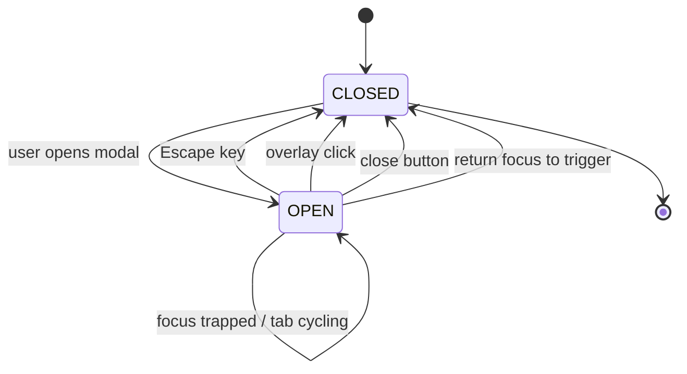
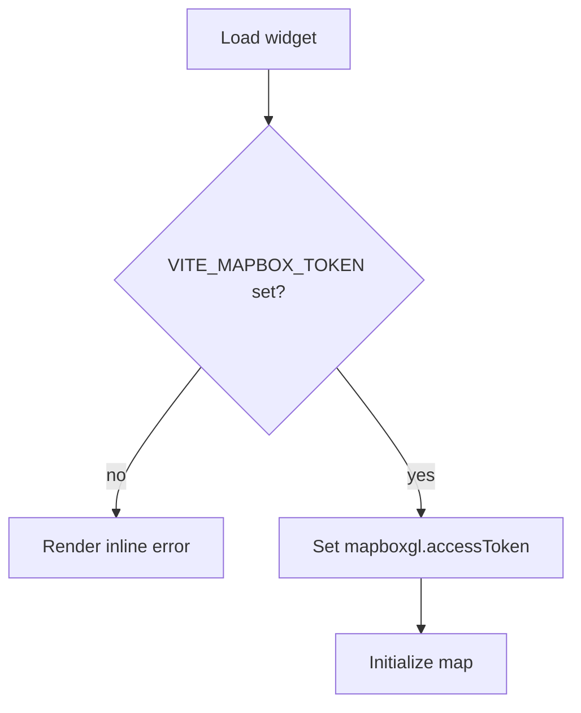

schema_version: 1

# PRD: Modal Accessibility Alignment + Mapbox Token Guard

## Executive Summary

This change standardizes core app modals on the existing accessible modal primitive and removes a hardcoded Mapbox token fallback in a widget. Users should be able to open, navigate, and dismiss modals with keyboard and screen reader support that matches platform expectations. The map widget should only initialize when a valid environment token is present and should provide a clear inline error when it is not.

## Problem / Context

Several app modals are built as bespoke overlay divs, bypassing the repository’s `ModalDialog` component that already implements focus trapping, Escape-to-close, and WAI-ARIA dialog semantics. This creates keyboard and screen reader accessibility gaps. Separately, the Pizzaz map widget contains a hardcoded Mapbox token fallback, which violates security policy and hides configuration issues in production.

## Goals

- Align all in-scope app modals with the `ModalDialog` primitive without changing modal content or layout.
- Ensure modals trap focus, close on Escape, return focus to the trigger, and announce dialog semantics correctly.
- Require `VITE_MAPBOX_TOKEN` for map widget initialization, and show a clear inline error state when missing.

## Acceptance Criteria

- [ ] All in-scope app modals use `ModalDialog` and no longer render manual overlay divs.
- [ ] Focus is trapped inside modals and Escape closes the modal.
- [ ] Focus returns to the triggering element after modal close.
- [ ] Modal headings are wired to `aria-labelledby` via `ModalDialog` title handling.
- [ ] Hardcoded Mapbox token fallback is removed.
- [ ] When `VITE_MAPBOX_TOKEN` is missing, the widget renders an inline error state and does not initialize Mapbox.
- [ ] No logs or UI output reveal token values or use fallback tokens.

## Non-Goals / Out of Scope

- No redesign of modal visuals or layout.
- No new modal primitives or dependencies.
- No refactors outside the identified modal files and the Mapbox widget.
- No changes to widget data sources or map behavior beyond token gating.

## Personas

- Jamie (Maintainer): needs predictable, accessible modal patterns and policy-compliant secrets handling.
- End User (Keyboard/Screen Reader): needs modals that trap focus, announce labels, and close with Escape.

## User Stories

STORY-001: Modal accessibility alignment
As a keyboard or screen reader user, I want app modals to trap focus and announce dialog semantics so that I can use them without losing context.
Acceptance Criteria:
- [ ] All in-scope app modals use `ModalDialog` and no longer render manual overlay divs.
- [ ] Focus is trapped inside modals and Escape closes the modal.
- [ ] Focus returns to the triggering element after modal close.
- [ ] Modal headings are wired to `aria-labelledby` via `ModalDialog` title handling.

STORY-002: Map widget token safety
As a developer, I want the Mapbox widget to fail clearly when no token is provided so that I can configure it correctly without leaking secrets.
Acceptance Criteria:
- [ ] Hardcoded Mapbox token fallback is removed.
- [ ] When `VITE_MAPBOX_TOKEN` is missing, the widget renders an inline error state and does not initialize Mapbox.
- [ ] No logs or UI output reveal token values or use fallback tokens.

## Functional Requirements

- Replace modal shells in:
  - `packages/ui/src/app/chat/compose/ProEditConfigModal/ProEditConfigModal.tsx`
  - `packages/ui/src/app/chat/ChatSidebar/modals/NewProjectModal/NewProjectModal.tsx`
  - `packages/ui/src/app/chat/ChatSidebar/modals/ProjectSettingsModal/ProjectSettingsModal.tsx`
  with `ModalDialog` while preserving internal content and styles.
- Remove the Mapbox token fallback in `packages/widgets/src/widgets/pizzaz/pizzaz-map/main.tsx`.
- Add a visible inline error state for missing `VITE_MAPBOX_TOKEN` (local to the widget for now).

## Non-Functional Requirements

- Accessibility: focus trap, Escape to close, focus return, correct dialog semantics.
- Security: no hardcoded tokens or secret exposure, no fallback token usage.
- Maintainability: use existing primitives and patterns; no new deps.
- Stability: no behavioral or visual regressions beyond the modal shell and token guard.

## UX / Interaction Notes

- Modal visuals and layout remain unchanged; only the modal wrapper changes.
- The map widget error state should be concise and actionable (e.g., "VITE_MAPBOX_TOKEN is required to use the map widget.") and appear in place of the map.

## Component Behavior / State Model

Modal interaction flow:

Map widget token guard:

## Metrics / Success Criteria

- 100% of in-scope app modals use `ModalDialog`.
- Manual verification: Tab key cycles within modal; Escape closes modal; focus returns to trigger.
- Map widget initializes only when token is configured; missing token shows inline error.

## Risks and Mitigations

- Risk: Visual regressions if modal wrapper styles are not preserved.
  Mitigation: Carry forward existing class names via `ModalDialog` props and verify layouts manually.
- Risk: Map widget becomes unusable in environments missing the token.
  Mitigation: Provide clear inline error message with configuration hint.

## Dependencies

- Existing `ModalDialog` component in `packages/ui/src/components/ui/overlays/Modal/Modal.tsx`.
- Environment variable `VITE_MAPBOX_TOKEN` for map widget.

## Rollout / Validation

- Update components, then run `pnpm lint` if feasible.
  Pass = lint completes without errors; Fail = any lint error.
- Manual checks:
  - Open each modal, verify focus trap, Escape close, and overlay click close.
  - Verify focus returns to the triggering element on close.
  - Run map widget without token to confirm error state renders and Mapbox does not initialize.
  Pass = all checks observed; Fail = any missing behavior.

Rollback plan: revert the modal wrapper changes and/or the token guard in the specific files if regressions occur, then re-run manual checks.

## Open Questions

None. The widget error state will be local to the map widget for now.
