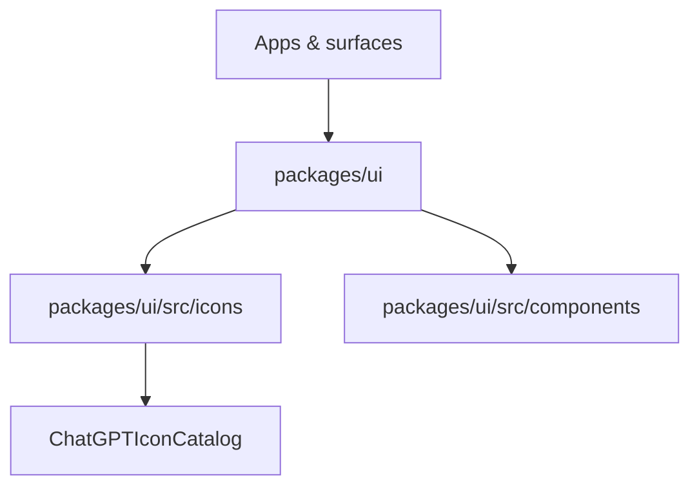

# FORJAMIE.md

## TL;DR
This repo is a pnpm workspace monorepo for AStudio, containing shared UI, runtime, tokens, widgets, and tooling packages plus platform-specific apps and MCP integrations. This update improves the ChatGPT icon catalog so clipboard copy failures (permissions, non-HTTPS, or unsupported APIs) show a user-facing fallback instead of throwing unhandled rejections.

## Architecture & Diagrams
High-level flow (UI usage):

Notes:
- Apps/surfaces import shared UI components and icon bundles from `packages/ui`.
- The icon catalog is a dev-facing surface for browsing and copying icon names.

## Codebase Map
- `apps/`: product surfaces and demos.
- `packages/ui/`: shared UI components, icons, and styling tokens.
- `packages/runtime/`: runtime utilities and shared logic.
- `packages/tokens/`: design tokens.
- `packages/widgets/`: widget bundles.
- `platforms/mcp/`: MCP server and tool contracts for ChatGPT integration.
- `docs/`: architecture, guides, audits, build pipeline docs.
- `scripts/`: build pipeline and compliance tooling.

## How to Run / Test
- Install: `pnpm install`
- Dev (all): `pnpm dev`
- Dev (web only): `pnpm dev:web`
- Lint: `pnpm lint`
- Format: `pnpm format`
- Tests (unit): `pnpm test`
- E2E (web): `pnpm test:e2e:web`

## Lessons Learned
- Clipboard APIs can fail due to permissions, insecure contexts, or missing browser support; always provide user-facing fallbacks to avoid uncaught rejections.

## Weaknesses & Improvements
- The icon catalog is currently a placeholder; it should be replaced with the full design-token-integrated version when ready.
- Consider a shared toast/notification utility for consistent copy-to-clipboard feedback across the app.

## Recent Changes
- 2026-02-04 — Added safe clipboard copy handling with a user-facing fallback in the ChatGPT icon catalog to prevent uncaught rejections. (Commit: f0cdce9)
