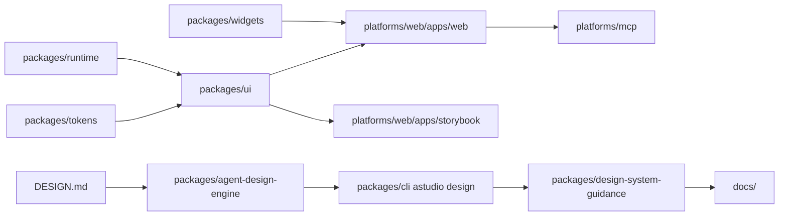

# FORJAMIE — design-system

## Table of Contents

- [Status](#status)
- [TL;DR](#tldr)
- [Architecture & data flow](#architecture--data-flow)
- [Codebase map](#codebase-map)
- [What's done / what's not](#whats-done--whats-not)
- [How to run locally](#how-to-run-locally)
- [How to test](#how-to-test)
- [Learnings & gotchas](#learnings--gotchas)
- [Weaknesses & improvements](#weaknesses--improvements)
- [Recent changes](#recent-changes)

## Status

<!-- STATUS_START -->
**Last updated:** 2026-04-25
**Production status:** IN_PROGRESS
**Overall health:** Yellow

| Area | Status | Notes |
| --- | --- | --- |
| Build / CI | Yellow | Focused policy, token, matrix, docs, guidance, whitespace, browser, widget a11y, and aggregate build gates pass for the Agent Design Engine slice |
| Tests | Yellow | Agent-design and release-readiness gates pass (`agent-design-engine`, `cli`, `design-system-guidance`, web E2E, widget a11y, and root build), including fixture-backed CLI JSON/recovery/migration coverage |
| Security | Clean | 13 CVEs patched; GitHub Actions SHA-pinned |
| Open PRs | 0 | |
| Blockers | None | |
<!-- STATUS_END -->

## TL;DR

This monorepo is the aStudio design system and Apps SDK UI foundation. It ships reusable token, UI, runtime, icon, and widget packages, plus example web and Storybook surfaces and an MCP integration harness so downstream apps can build consistent ChatGPT-style experiences.

`DESIGN.md` is now the repo-level agent UI contract. Coding agents can use `astudio design ...` to lint, diff, export, initialize, migrate, and diagnose the contract before generating UI, while `packages/agent-design-engine` owns the semantic parsing and rule provenance behind those commands.

## Architecture & data flow


```mermaid
flowchart LR
  Tokens["packages/tokens"] --> UI["packages/ui"]
  Runtime["packages/runtime"] --> UI
  UI --> Web["platforms/web/apps/web"]
  UI --> Storybook["platforms/web/apps/storybook"]
  Widgets["packages/widgets"] --> Web
  Web --> MCP["platforms/mcp"]
  DesignMd["DESIGN.md"] --> Engine["packages/agent-design-engine"]
  Engine --> CLI["packages/cli astudio design"]
  CLI --> Guidance["packages/design-system-guidance"]
  Guidance --> Docs["docs/"]
```

- `packages/tokens` generates the design primitives and semantic variables that feed the UI layer.
- `packages/ui` is the primary React component library consumed by the web app, Storybook, and widget surfaces.
- `packages/runtime` provides host adapters and environment wiring for embedded and standalone usage.
- `packages/widgets` packages standalone widget bundles used by the web surface and MCP integration paths.
- `platforms/mcp` contains the MCP integration harness and tool contract tests.
- `packages/design-system-guidance` packages the policy and guidance checks used to keep downstream consumers aligned, including repo-scoped protected-surface enforcement and an exemption ledger.
- `packages/agent-design-engine` parses `DESIGN.md`, computes professional-UI rule provenance, lints semantic UI contract requirements, diffs design contracts, and exports agent-readable token/contract payloads.
- `pnpm agent-design:lint` is the clean-checkout-safe root lint wrapper. It builds `packages/agent-design-engine` and `packages/cli` before invoking `packages/cli/dist/index.js`, so direct `dist` execution does not depend on tracked build artifacts.
- `packages/cli` exposes the engine through `astudio design` commands while keeping the existing `astudio.command.v1` JSON envelope for agents.
- `packages/design-system-guidance` now accepts additive `designContract` rollout state and migration metadata while preserving legacy v1 guidance fields. Its migration path enforces the command transition table and authenticates rollback metadata before any writable rollback or resume side effect.

## Codebase map

- `packages/ui/` contains the core React components, styles, integrations, and Vitest coverage for the public UI library.
- `packages/tokens/` owns token generation, validation, and the source-of-truth design primitives.
- `packages/runtime/` contains host adapters and runtime abstractions shared by UI consumers.
- `packages/agent-design-engine/` owns the `DESIGN.md` semantic engine, rule manifest, parity fixtures, and engine tests.
- `packages/widgets/` contains embeddable widget bundles and a11y coverage for widget delivery.
- `platforms/web/apps/web/` is the primary development surface for exercising the design system in a real app shell.
- `platforms/web/apps/storybook/` is the component documentation and visual verification surface.
- `platforms/mcp/` contains the MCP server integration harness and contract tests.
- `docs/` holds architecture, adoption, rollout, and governance guidance.
- `scripts/` holds build, validation, drift-check, onboarding, and release tooling.
- Consumer projects should import `@design-studio/ui/styles.css` as the public stylesheet entry; internal style subpaths are implementation details and raw `file:` installs of `packages/ui` are not a supported external adoption path.

## What's done / what's not

| Area | State | Notes |
| --- | --- | --- |
| Core package structure | Done | Tokens, UI, runtime, widgets, icons, and MCP/web surfaces are all established |
| Adoption and guidance docs | Done | Onboarding command center, release docs, and governance docs exist |
| Guidance package | Done | `@brainwav/design-system-guidance` now supports repo-scoped `error`/`warn`/`exempt` enforcement, path specificity, and exemption-ledger validation |
| Agent design engine | Initial vertical slice done | `@brainwav/agent-design-engine` parses/lints/diffs/exports `DESIGN.md` and records rule-source provenance for agent UI work |
| aStudio design CLI | Initial vertical slice done | `astudio design lint/diff/export/check-brand/init/migrate/doctor` is available with schema-backed JSON envelopes, one-line stdout fixtures, and write gates |
| Protected settings migration | In progress | The initial settings wave is migrated onto shared shell/composition patterns, with explicit state stories and jsdom exemplar tests for the protected settings slice; broader app/storybook warn backlog remains intentionally non-blocking |
| Visual regression workflow | In progress | Root visual scripts now route through `scripts/run-playwright-suite.mjs` and `packages/ui build:visual`, and the exemplar gate now covers both the template browser shell and an isolated template-widget shell route |
| Current dependency hygiene | In progress | This change-set pins `vitest-axe` back to `1.0.0-pre.3` for deterministic installs |
| Long-term debt cleanup | In progress | Lint, icon a11y, and docs maintenance remain ongoing work |

## How to run locally

```bash
pnpm install
pnpm dev
pnpm dev:storybook
pnpm build
pnpm agent-design:lint
```

## How to test

```bash
pnpm test
pnpm lint
pnpm format:check
pnpm build
pnpm test:policy
pnpm test:exemplar-evaluation:list
pnpm test:exemplar-evaluation:update
pnpm design-system-guidance:ratchet
pnpm agent-design:boundaries
pnpm agent-design:type-check
pnpm agent-design:test
pnpm -C packages/design-system-guidance build
pnpm -C packages/cli build
pnpm -C packages/cli test
pnpm test:visual:web -- --list
pnpm test:visual:storybook -- --list
bash scripts/check-environment.sh
```

The visual suites now go through `scripts/run-playwright-suite.mjs`, which prebuilds `packages/ui` with `pnpm -C packages/ui build:visual` before handing the remaining args straight to Playwright. Use that path when you need reliable `--list`, `--grep`, or `--update-snapshots` behavior from the root scripts without leaving the package in a declaration-broken state.
The policy-owned exemplar slice now has its own root entry points. Use `pnpm test:exemplar-evaluation:list` to inspect the exact protected Storybook checks, and `pnpm test:exemplar-evaluation:update` to refresh only those baselines instead of hand-copying long `PLAYWRIGHT_STORYBOOK_*` env strings. `TemplateBrowserPage` is now part of the always-on exemplar slice, but that browser-backed check runs as an explicit exemplar gate rather than as part of the browser-free `pnpm test:policy` contract.
For template-family QA, use `/templates` for the searchable browser shell and `/template-widget/<template-id>` for the isolated single-template widget shell that mirrors widget-style rendering without needing `VITE_TEMPLATE_ID`.
Committed visual baselines live under `tests/visual/__snapshots__`. Local Playwright HTML reports, nested Vite cache outputs under `node_modules/.vite`, nested `.tmp` build scratch files, Storybook screenshot captures, package/app `dist` outputs, and ad hoc `reports/audit-*` outputs are now gitignored so browser and build runs stop polluting the branch.

## Learnings & gotchas

See also: `~/.codex/instructions/Learnings.md`

- Keep `FORJAMIE.md` detailed and current whenever behavior, structure, config, or tooling changes.
- Pre-release dependencies should stay pinned when the repo depends on exact lockfile behavior across workspaces.
- Use the repo preflight helper before path-sensitive or multi-step git workflows.
- Guidance-policy exemptions must stop applying the moment they expire; otherwise CI reports the ledger drift but still hides the real surface-level rule failure that needs cleanup.
- Local Memory preflight probes need to honor the configured `rest_api.host` for every REST smoke request, not just health checks, or valid non-loopback setups look broken.
- The exemplar-evaluation gate depends on Playwright browser binaries being installed locally; if `pnpm test:exemplar-evaluation` fails before running tests, verify Chromium is provisioned for Playwright in this environment. `pnpm test:policy` should stay browser-free so pre-Playwright CI and release workflows do not fail on unrelated changes.
- `TemplateWidgetPage` only rendered during `VITE_TEMPLATE_ID` widget builds before this slice. The stable runtime route for browser QA is now `/template-widget/<template-id>`, which gives the web visual suite a deterministic way to protect the isolated widget shell.
- Protected settings stories are inside the same repo-governed surface family as the app panels, so even Storybook-only scaffolding should avoid literal background hex values or other policy escapes that would add noisy guidance debt.
- `TemplateBrowserPage` is now part of the default exemplar gate. If `pnpm test:exemplar-evaluation` fails on the template-browser slice, treat that as a real always-on page regression rather than an opt-in baseline workflow.
- The root visual scripts are now the canonical entry point for listing or filtering Playwright coverage. They use the `packages/ui build:visual` path, which preserves declaration output while still avoiding the earlier visual-only typegen noise from internal Storybook demo code.
- The guidance CLI now supports `--json` for policy tooling, and large guidance payloads must be flushed before exit. If a future automation sees truncated JSON around 64 KB, check the CLI output path before blaming the policy consumer.
- If Storybook or web visual runs suddenly explode into dozens of identical Playwright launch failures, the likely problem is a missing local browser binary rather than dozens of broken stories. The suite wrapper now preflights Chromium for non-`--list` runs and prints the single remediation command.
- If you need to refresh the protected settings exemplar baselines, do not paste the long `PLAYWRIGHT_STORYBOOK_STORY_IDS=...` command by hand. Use `pnpm test:exemplar-evaluation:update` so the update path stays aligned with the policy runner's canonical `components-settings-*` story IDs.
- Storybook screenshot URLs must set both `globals.theme` and `backgrounds.value`, and they must derive their base URL from `PLAYWRIGHT_STORYBOOK_BASE_URL` / `PLAYWRIGHT_STORYBOOK_PORT` instead of hard-coding `localhost:6006`. Otherwise “light” screenshots can silently render the dark theme, and reused non-default Storybook servers will fail.
- Storybook visual captures now disable Agentation and Dialkit overlays by URL flag during Playwright runs. If a visual failure suddenly shows the MCP/annotation panel inside the screenshot, the preview/test URL contract has drifted and should be repaired before blessing any baseline.
- Storybook visual regression now runs single-worker with a 90s test timeout. That is intentional: the settings exemplar slice proved flaky under local parallel capture and late dark-theme sweeps, so determinism now wins over speed for this gate.
- Storybook visual captures now pin Playwright to `en-US` / `UTC`, and fullscreen exemplar stories are forced onto the exact `1280x720` capture surface inside the spec harness. If Ubuntu-only screenshot drift shows up on chat/settings fullscreen stories, check the visual harness before re-blessing baselines.
- The exemplar visual gate now belongs to the macOS build lane in CI, not the Ubuntu web lane. The committed Storybook/fullscreen baselines are currently mac-recorded, so running the always-on exemplar check on macOS keeps the gate trustworthy while Linux still handles policy/build coverage.
- Storybook dev must ignore Playwright artifact paths during visual runs. If the server starts reloading or dropping mid-capture, check `.storybook/main.ts` first and confirm `playwright-report`, `test-results`, and `__snapshots__` are excluded from Vite watch globs so the visual gate is not watching its own outputs.
- The touched-file ratchet must include untracked files via `git ls-files --others --exclude-standard`, not just tracked diffs. Otherwise a brand-new protected-surface file can dodge the ratchet until it is staged.
- Keep the committed visual baselines, but ignore local runtime artifacts. The repo now explicitly ignores nested `node_modules/.vite`, nested `node_modules/.tmp`, Playwright HTML reports, and `reports/audit-*` outputs so UI verification runs do not turn branch state into cache noise.
- Design command outputs go through the same masking path as other `astudio` JSON envelopes. If agent consumers need raw token payloads for a safe local export, use the dedicated `design export` artifact path and validate the resulting JSON before handing it to downstream tooling.
- The migration transition table should run before rollback metadata lookup. That keeps invalid state/operation pairs as `E_DESIGN_MIGRATION_STATE_INVALID` no-op failures, while metadata readability tests must start from rollback-eligible states such as `design-md/active`, `partial`, or `failed`.
- Rollback metadata authentication is intentionally local-artifact bound rather than a remote signing service in this pre-GA slice. Treat the rollback artifact signing key, `metadataDigest`, `metadataSignature`, path-root checks, config checksums, and `DESIGN.md` checksums as one fail-closed contract: if any piece drifts, rollback/resume must exit `3` without mutation.
- The `DESIGN.md` engine computes source digests from `docs/design-system/PROFESSIONAL_UI_CONTRACT.md`, `AGENT_UI_ROUTING.md`, `COMPONENT_LIFECYCLE.json`, and `COVERAGE_MATRIX.json`. If any of those files move or become unreadable, design lint/export should fail before semantic evaluation.
- `DESIGN.md` schema versions are fail-closed. The v1 engine only accepts `schemaVersion: agent-design.v1`; future contract versions must add explicit parser/rule-pack support before `lint` or `export` can proceed.
- `DESIGN.md` section line numbers must stay anchored to the original file, including YAML frontmatter. Lint findings use those lines as agent remediation evidence.
- `astudio design init` validates the starter contract before writing, but it must still enforce the write gate first so a missing `--write` remains a policy error instead of a provenance error.
- Package-level Biome scripts need to use the same pinned Biome 2.x command as the root scripts. The workspace still contains older Biome 1.x dependencies for other packages, and those cannot parse the current `biome.json` schema.
- Browser-backed Playwright gates need a provisioned Chromium cache and a macOS launch path that is not blocked by the Codex sandbox. If every browser test fails at launch with `bootstrap_check_in ... Permission denied (1100)`, treat it as an environment permission issue and rerun the browser gate through the approved unsandboxed path before debugging UI code.
- Package manifests can point at `dist` in `main`, `types`, `exports`, `bin`, or `files`, but those generated outputs are no longer committed source. Build before pack, publish, or direct `node packages/*/dist/...` execution.
- `pnpm generated-source:check` is the canonical freshness gate for tracked generated runtime inputs. It regenerates the web template registry, widget JavaScript manifest, and Cloudflare worker manifest, formats the tracked generated source with Biome 2.3.11, and fails if the committed snapshot is stale.
- `packages/widgets/src/sdk/generated/widget-manifest.ts` is still an ignored mutable local mirror. The tracked runtime authority is `packages/widgets/src/sdk/generated/widget-manifest.js`, and Cloudflare consumes its own deterministic `src/worker/widget-manifest.generated.ts` mirror after `pnpm -C packages/cloudflare-template run prebuild`.
- Workspace package scripts should prefer `node --import tsx ...` when they depend on hoisted `tsx`; bare package-local `tsx` shims have already failed in this workspace layout.
- `docs/plans/README.md`, `reports/README.md`, and `artifacts/reviews/README.md` are now the authority indexes for plan, report, and review-evidence routing. Prefer those front doors before trusting filename recency or old embedded status text.
- `pnpm tracked-ignored:check` is the guard that keeps ignored runtime, cache, test-output, build-output, and ad hoc audit artifacts from becoming tracked again. It allows the documented planning/config exceptions, so do not replace it with a blanket ban on every `git ls-files -ci --exclude-standard` result.
- `docs:lint` is the canonical docs quality command; `doc:lint` is only a compatibility alias. Theme propagation has an active property-test surface at `pnpm test:theme-propagation`, and the tree-shaking prototype is intentionally retained behind `pnpm validation-prototype:build`.
- Rollback quarantine recovery depends on preserving `design-md/partial` until the quarantine move succeeds. Switching to `legacy/partial` before removing `DESIGN.md` strands retry paths because authenticated metadata still expects the design file and active/partial config checksums.

## Weaknesses & improvements

- Dependency drift can still show up as lockfile-only noise; keep package specifiers aligned with the lockfile when pre-release packages are involved.
- `FORJAMIE.md` had started drifting toward a placeholder template; keep it as a real project map, not just a status shell.
- The repo still carries known lint and accessibility debt that should be paid down incrementally as touched areas are updated.
- Cross-project adoption used to look more flexible than it really was; keep README and checklist guidance aligned with the actual exported package surface and supported install modes.
- Design-system trust is weaker than it should be because token validation and coverage freshness can fail while broader policy checks still pass; align root policy with semantic-slot and design-system integrity rules before asking agents to generate more product UI.
- The repo-wide guidance command now passes, but it still reports a large `warn` backlog across reusable UI, storybook, and showcase surfaces. That backlog is visible by design and should be ratcheted down incrementally instead of hidden.
- The web and Storybook visual suites are finally deterministic enough to build on, and the first touched-file ratchet is now in place for the initial protected surface set. The remaining work is widening that ratchet gradually without turning warning debt back into hidden drift.
- The first touched-file ratchet now covers the full settings panel/story family, the touched forms component slice, and app pages including both template pages. It should keep expanding gradually, but only after adjacent surfaces stay clean long enough that the next boundary is believable.
- `packages/ui` still carries some internal Storybook `_holding` demo code that looks like package-consumer code. Keep that material out of declaration generation, or it will reintroduce self-import type noise into otherwise healthy package builds.
- `packages/tokens/src/shadows.ts` is generated, but it cannot be a pure mirror of the DTCG shadow source. The DTCG file only defines the legacy `card/pip/pill/close` map; the generated TypeScript layer must also re-emit the semantic `elevation` API and `ElevationToken` type or `packages/tokens/src/index.ts` will compile locally until the next `pnpm generate:tokens`, then break in CI.
- The first `agent-design-engine` slice is intentionally semantic and deterministic, but it is not yet a full AST-aware UI reviewer. It catches missing contract concepts, not every bad JSX or CSS pattern an agent might write.
- `astudio design migrate` now enforces its state transition table, writes authenticated rollback metadata, checks rollback paths and file checksums before mutation, marks crash-recoverable `partial` state before final mutation, and quarantines migrated `DESIGN.md` files during rollback. Quarantine paths are collision-safe and covered by repeated rollback/remigration plus concurrent-writer race tests; remaining pre-GA migration hardening should focus on support-window compatibility fixtures and explicit idempotency edge cases.
- `astudio design check-brand --strict` now has non-tautological mismatch logic, but only `astudio-default@1` is currently supported. Add a second supported profile fixture before treating cross-profile mismatch behavior as fully proven.
- `pnpm generated-source:check` intentionally rebuilds widget assets and may print Vite chunk-size warnings. Treat it as a correctness/freshness gate, not as the package performance budget.
- `pnpm agent-design:boundaries` is the ownership tripwire for the Agent Design Engine: wrappers can call public package exports, but parser, lint, diff, export, and profile-comparison implementation must stay in `packages/agent-design-engine`.

## Recent changes

### 2026-04-25

- **Exemplar surface composition migration**: JSC-76 migrates the issue-listed product exemplars (`HarnessPage`, `TemplateBrowserPage`, `AppsPanel`, and `ManageAppsPanel`) onto `ProductPageShell`, `ProductPanel`, and `ProductSection`, keeps them clean of foundation-token bypasses and literal style escapes, and documents the follow-on pattern in `docs/design-system/AGENT_UI_ROUTING.md` plus `artifacts/design-system/jsc-76-exemplar-surface-migration.md`.
- **External execution exit normalization**: JSC-221 normalizes subprocess failures behind `astudio` external command execution so nonzero child exits, start failures, signal termination, and timeouts produce deterministic `E_EXEC` machine output instead of leaking raw child status as the wrapper exit class. JSON mode still captures child stdout/stderr under `data` but keeps process stderr empty and reports a stable `failure_kind` plus normalized `exit_code` for agent recovery.
- **Design recovery fixture matrix**: JSC-222 expands the design-command fixture suite across policy, safety, compatibility, discovery, profile, warning-only, and execution failures. Safe retries now stay in structured `recovery.nextCommand` argv/cwd JSON, unsafe or unavailable paths emit `recoveryUnavailableReason`, warning-only doctor output keeps `errors[]` empty, and `design doctor --active --exec` exercises the normalized external execution contract through an active pnpm check.
- **Parser regex hardening**: agent-design `DESIGN.md` section parsing now uses a bounded heading scanner instead of a regex over library input, closing the CodeQL polynomial-regex alert while preserving heading levels, trimmed titles, and section line numbers.
- **CI annotation cleanup**: strict type-check annotations are resolved in the coverage matrix generator and visual accent tests, the informational strict check now sanitizes its log tail so pre-existing strict debt does not create PR annotations, and the macOS lane verifies the runner's installed Swift toolchain directly instead of invoking the Node 20-based `swift-actions/setup-swift` action.
- **Storybook deploy annotation guard**: the a11y job now exposes its Storybook-change detector as a job output, and the Cloudflare Pages deploy job only runs on PRs when that output says Storybook artifacts were built. Non-Storybook PRs no longer emit a missing `storybook-static` artifact annotation.
- **Exemplar visual clean-checkout repair**: `pnpm test:exemplar-evaluation` now builds workspace libraries before running Storybook and web visual exemplar checks, so clean macOS CI runners can resolve token package declarations before Vite's declaration generation starts.
- **Rollback support-window compatibility**: rollback metadata validation now uses the compatibility manifest's explicit `legacySupport.rollbackMetadataMinWrapper` rather than the normal design-command `minWrapper`, so the current wrapper can read older rollback metadata across the published legacy support window while still rejecting metadata older than that window.
- **macOS CI Swift runner verification**: the macOS build lane now checks the runner-provided Swift toolchain with `swift --version` and `xcrun --find swift`, avoiding the deprecated JavaScript setup action while still proving Swift availability before exemplar visuals run.
- **Harness pre-push runtime repair**: `scripts/harness-cli.sh` now resolves project mise shims before Homebrew tools and falls back to the mise-managed `harness` command when the private `@brainwav/coding-harness` package is not installed in the repo. The repo runtime pin/contract use `uv 0.11.3`, and the Semgrep changed-file gate now rebuilds its pinned cache when a broken launcher makes the version probe exit nonzero.
- **Generated-source clean-checkout repair**: `pnpm generated-source:check` now builds the workspace libraries before regenerating the widget build manifest, so clean CI runners can resolve `@design-studio/ui` package exports without depending on an earlier build step.
- **Rollback quarantine race coverage**: JSC-220 makes rollback quarantine directories come from the authenticated rollback metadata `operationId`, rejects path-unsafe operation ids, preserves retryable `design-md/partial` state until rollback quarantine succeeds, and expands CLI coverage for quarantine collisions, repeated rollback/remigration artifact retention, concurrent rollback writers, and stale temp/lock cleanup after successful and failed writes.
- **Agent design review fixes**: `packages/agent-design-engine` now rejects unsupported `DESIGN.md` schema versions with `E_DESIGN_SCHEMA_INVALID`, and `pnpm agent-design:lint` builds both the engine and CLI before executing the generated CLI entrypoint so clean checkouts do not depend on tracked `dist` artifacts.
- **Rollback metadata authentication**: JSC-219 expands migration rollback metadata with required schema, wrapper, path, checksum, support-window, digest, and HMAC signature fields bound to the local rollback artifact signing key plus compatibility manifest. Rollback and resume now reject tampered metadata, forged public signatures, malformed or unsupported wrapper versions, symlink escapes, active-config checksum drift, and `DESIGN.md` checksum drift with `E_DESIGN_ROLLBACK_METADATA_UNREADABLE` before any mutation.
- **Migration transition hardening**: JSC-218 encodes the `astudio design migrate` transition table in `packages/design-system-guidance`, rejects invalid command/state pairs with `E_DESIGN_MIGRATION_STATE_INVALID` before mutation, writes `migrationState: partial` before final config mutation, and adds CLI coverage for failed-state resume, invalid-transition no-op behavior, and fault-injected `E_PARTIAL` recovery through `migrate --resume`.
- **Agent design boundary guard**: JSC-217 adds `pnpm agent-design:boundaries` and a self-test mode to prevent other packages from deep-importing `packages/agent-design-engine/src/**` or reimplementing `DESIGN.md` parser/rule ownership in `packages/design-system-guidance`. The guard now runs inside `pnpm test:policy`, and the `DESIGN.md` contract docs plus source plan mark the boundary enforcement item complete.

### 2026-04-24

- **Orphan lifecycle cleanup**: JSC-229 removes the unused one-shot autodocs tagging script, turns `doc:lint` into a non-drifting alias for `docs:lint`, wires `scripts/theme-propagation.test.mjs` into `pnpm test:theme-propagation` and `pnpm test:web:property`, and gives the harness helper plus validation prototype explicit root command surfaces.
- **Tracked ignored artifact guard**: JSC-228 adds `pnpm tracked-ignored:check` plus classifier self-tests, documents the allowed tracked-ignored planning/config exceptions in `docs/plans/2026-04-24-jsc228-tracked-ignored-guard.md`, and wires the guard into `pnpm test:policy` so runtime/cache/test/build/audit artifacts cannot quietly return to source control.
- **Generated source contract**: JSC-226 classifies the tracked web template registry, widget JavaScript manifest, and Cloudflare worker manifest as committed deterministic runtime inputs; keeps the mutable TypeScript widget manifest ignored; removes the Cloudflare manifest timestamp; fixes the web registry script to use `node --import tsx`; and adds `pnpm generated-source:check` to root policy.
- **Docs/report authority cleanup**: JSC-227 adds authority indexes for `docs/plans/**`, `reports/**`, and `artifacts/reviews/**`, archives the January 2026 template-migration report cluster under `reports/archive/2026-01-template-migration/`, and moves older multi-round Agent Design Engine review artifacts under `artifacts/reviews/archive/2026-04-agent-design-engine/` while keeping round 3 summaries as current review authority.
- **Build artifact contract cleanup**: JSC-225 defines `dist/**`, `platforms/web/apps/web/dist/**`, and `platforms/web/apps/storybook/screenshots/**` as generated outputs rather than source-control authority, removes 802 tracked ignored generated files from the Git index, and records the build-before-pack/publish plus Playwright/Argos visual evidence contract in `docs/plans/2026-04-24-jsc225-build-artifact-contract.md`.
- **Repo-wide cleanup inventory**: JSC-223 removed tracked ignored runtime artifacts from the Git index while keeping local files on disk, deleted three accidental zero-byte root files (`EOF`, `npm`, and `{`), and added `docs/plans/2026-04-24-jsc223-repo-cleanup-inventory.md` to separate safe cleanup from higher-risk publish-output, generated-source, docs-archive, and CI-hygiene follow-ups.
- **Agent design review hardening**: parser headings now preserve original `DESIGN.md` line numbers after frontmatter, component extraction only records explicit backticked component names, and profile fallback no longer exposes an unused manifest-default path.
- **Agent review follow-up**: the he-work agent pass added a cross-package profile parity test so every `@brainwav/design-system-guidance` supported profile must also parse through `@brainwav/agent-design-engine`, and the branch drops tracked Vite/test-output artifacts that were already ignored by repo policy.
- **Design command protocol fixtures**: `packages/cli/tests/fixtures/design-schemas/astudio-design-command.v1.schema.json` and `packages/cli/tests/fixtures/design-command-fixtures.json` now lock every `astudio design *` success command to the `astudio.command.v1` envelope, expected `data.kind`, one-line JSON stdout, empty stderr, and representative policy/discovery/profile recovery errors.
- **Design CLI safety fixes**: `astudio design init` validates before writing, `astudio design migrate` resolves subdirectory calls to the project root, rollback refuses corrupt metadata without mutating config, rollback quarantines migrated `DESIGN.md`, and CLI tests now cover CI discovery, ambiguity, profile errors, fail-on-regression, root-target migration behavior, and structured recovery payloads.
- **Compatibility and profile surface added**: `@brainwav/design-system-guidance` now owns the v1 design compatibility manifest, supported profile list, and supported command-schema guard used by `astudio design` before emitting machine-readable payloads.
- **Agent adoption docs landed**: `docs/guides/DESIGN_MD_CONTRACT.md`, `docs/guides/PRIVATE_GUIDANCE_PACKAGE.md`, `docs/design-system/CONTRACT.md`, `docs/guides/RELEASE_CHECKLIST.md`, and the JSC-208 baseline inventory now describe the `DESIGN.md` contract, rollout states, rollback flow, compatibility manifest, and validation lane.
- **Validation evidence**: `pnpm -C packages/agent-design-engine test`, `pnpm -C packages/design-system-guidance type-check`, `pnpm -C packages/design-system-guidance build`, `pnpm -C packages/agent-design-engine type-check`, `pnpm -C packages/cli lint`, `pnpm -C packages/cli build`, `pnpm -C packages/design-system-guidance check:ci`, `pnpm -C packages/cli test`, `pnpm docs:lint`, `pnpm test:policy`, `pnpm validate:tokens`, `pnpm ds:matrix:check`, `pnpm design-system-guidance:check:ci`, and `git diff --check` all pass locally for this focused slice.
- **Release-readiness evidence**: `pnpm exec playwright install chromium`, `pnpm test:e2e:web`, `pnpm test:a11y:widgets`, and `pnpm build` pass locally after allowing Playwright to launch Chromium outside the macOS sandbox. The sandboxed browser run failed before test execution with Chromium `bootstrap_check_in ... Permission denied (1100)`, then the same suites passed unsandboxed.
- **Focused tooling alignment**: `packages/cli lint` now uses the same pinned Biome 2.3.11 command as the root lint script, avoiding the stale Biome 1.x parser path that cannot read the current root `biome.json`.
- **Docs lint sync repair**: `.vale.ini` now relies on the vendored `.vale/styles/Google` rules instead of asking `vale sync` to resolve the remote `Google` package alias, so `pnpm docs:lint` syncs zero packages and validates the current markdown/link set cleanly.

### 2026-04-23

- **Agent design engine added**: `packages/agent-design-engine` now owns the `DESIGN.md` parser, normalized contract model, professional UI rule manifest, lint findings with source references, semantic diff output, and JSON/DTCG/Tailwind export helpers. The frozen upstream source baseline for parity work is `/Users/jamiecraik/dev/system-design` at `8ecd4645b957e6a683a05fb9c79cd6c9028873d0`.
- **Repo-level DESIGN.md contract added**: root `DESIGN.md` captures the brand profile, surface roles, state/focus/motion/viewport expectations, component routing sources, and token notes that agents should use before designing UI.
- **Guidance wrapper migration path added**: `@brainwav/design-system-guidance` now accepts additive `designContract` state, exposes `migrateGuidanceConfig`, and supports `design-system-guidance migrate` dry-run/write flows with rollback metadata.
- **aStudio design CLI added**: `astudio design lint`, `diff`, `export`, `check-brand`, `init`, `migrate`, and `doctor` are registered under `packages/cli` with the existing `astudio.command.v1` JSON envelope. New root scripts `agent-design:type-check`, `agent-design:test`, `agent-design:build`, and `agent-design:lint` provide the focused validation lane.

### 2026-04-13

- **PnPM lockfile parser CI bump**: the repo and workflow pnpm pins moved from `10.28.0` to `10.33.0` across `package.json` and the GitHub Actions entrypoints. The change keeps the CI install parser on the current 10.x patch line after the Ubuntu `build (ubuntu-latest)` job reported a frozen-lockfile parse failure on PR `#145`.
- **Storybook dispatcher export-path fix (macOS CI unblock)**: `platforms/web/apps/storybook/scripts/storybook-dev.mjs` now resolves Storybook via the exported package subpath `storybook/internal/bin/dispatcher` instead of the non-exported `storybook/dist/bin/dispatcher.js` path. This removes the `ERR_PACKAGE_PATH_NOT_EXPORTED` startup crash in the macOS exemplar lane and keeps the wrapper-based launch flow intact.

### 2026-04-12

- **Workspace governance path-stability fix**: `scripts/verify-work.sh --workspace-governance` now keeps manifest-derived `inventory`, `classification`, and `metrics` inputs repo-relative when invoking governance scripts. Validation still resolves absolute paths for existence checks, but generated governance reports no longer capture machine-specific checkout roots.
- **Storybook Playwright server context fix (intermediate)**: `platforms/web/apps/storybook/playwright.visual.config.ts` briefly launched Storybook from the app directory (`cwd: __dirname`) to avoid workspace-root command-resolution drift.
- **Workspace inventory freshness refresh**: `docs/hooks-governance/repo-profile-matrix.json` timestamps were refreshed to the current validation window so `rollout_check.py` does not fail immediately due to an already-expired `last_validated_at`.
- **Empty inventory guard for rollout checks**: `scripts/hook-governance/rollout_check.py` now fails closed when the provided inventory has no repos to evaluate, so `--workspace-governance` no longer reports a passing run from an empty `{"repos": []}` payload.
- **Storybook CI launcher fix (current)**: `platforms/web/apps/storybook/playwright.visual.config.ts` now launches the repo wrapper script (`scripts/storybook-dev.mjs`) from the Storybook app directory and passes `STORYBOOK_PORT` explicitly, while the wrapper itself runs the workspace-root Storybook dispatcher via `node ../../../../node_modules/storybook/dist/bin/dispatcher.js dev -p ... -c .storybook`. This avoids the app-local bin shim that was resolving to a missing dispatcher path in CI.
- **Docstring-ratchet CLI contract parity**: `scripts/hook-governance/evaluate_docstring_ratchet.py` now accepts `--plain` and `--no-color` compatibility flags and emits consistent service-prefixed stdout/stderr messages (`[design-system.docstring-ratchet] ...`) so automation and reviewers can reliably attribute failures.
- **Workspace Vite shim hardening**: `packages/ui`, `packages/json-render`, and `packages/widgets` now run build/dev scripts through the root-installed Vite binary (`node ../../node_modules/vite/bin/vite.js ...`) instead of per-package shim resolution. This avoids CI failures when package-local `.bin/vite` shims are missing under hoisted installs while preserving package-local cwd for each Vite config.
- **Web app Vite shim hardening**: `platforms/web/apps/web` now runs `dev`, `build`, `preview`, and `build:widget` through the root-installed Vite binary (`node ../../../../node_modules/vite/bin/vite.js ...`). This fixes CI/web build failures where `platforms/web/apps/web/node_modules/vite/bin/vite.js` was missing under hoisted installs.
- **Workspace Vitest shim hardening**: `packages/ui` test scripts now run through the root-installed Vitest entrypoint (`node ../../node_modules/vitest/vitest.mjs ...`) so hook/test runs stop failing when package-local Vitest shims are absent in hoisted installs.
- **CI token generation hardening**: `packages/tokens/package.json` now runs token generation and validation scripts via `node --import tsx` instead of package-local `tsx` bin shims. This removes dependency on per-package `.bin` layout and fixes CI failures where `packages/tokens/node_modules/tsx/dist/cli.mjs` was missing under hoisted installs.
- **Tailwind preset resolution stability**: `tailwind.config.base.ts` now imports the preset through the monorepo source path (`./packages/tokens/tailwind.preset`) so strict TypeScript checks stop failing on unresolved `@design-studio/tokens/tailwind.preset` during workspace builds.

### 2026-04-11

- **Canonical `prek` hook contract**: the root hook surfaces now align on `prek` only. `Makefile` adds the required `hooks-commit-msg` wrapper, `prek.toml` installs `pre-commit`, `commit-msg`, and `pre-push` from canonical wrapper targets, `scripts/setup-git-hooks.js` now strips legacy package hook metadata before running `prek install`, and `scripts/check-environment.sh` fails if old package-level hook metadata is still present.
- **Husky fully removed**: the stale `.husky/` bootstrap directory has been deleted, and `scripts/check-environment.sh` now fails if Husky scaffolding comes back. `prek` is the only supported hook runtime in this repo.
- **Repo-canonical tooling inventory**: `scripts/check-environment.sh` now treats `docs/agents/tooling.md` as the default local tooling inventory path instead of a home-directory file. The script now owns the canonical enforced lists (`required_mise_tools`, `required_bins`, and required Codex actions), can generate the doc via `bash scripts/check-environment.sh --write-tooling-doc`, and fails if the checked-in doc drifts from those enforced lists.
- **Environment gate portability fix**: local and CI environments now read tooling evidence from repository files only. This removes external-path assumptions and keeps `bash scripts/check-environment.sh` portable across contributors and runners.
- **Worktree hook bootstrap cleanup**: `scripts/prepare-worktree.sh` no longer tries to execute a removed legacy package-hook binary after `node scripts/setup-git-hooks.js`. Worktree bootstrap now goes through the same `prek install` path as the rest of the repo, which removes one dead compatibility branch and keeps the runtime contract aligned with the validator text.
- **Sandbox-safe prek hook regeneration**: `scripts/setup-git-hooks.js` now patches generated `prek` shims so each hook exports `PREK_HOME="${PREK_HOME:-$HERE/../.cache/prek}"` before `hook-impl`, keeping cache/log writes repo-local under `.git/.cache/prek` in sandboxed environments. Root `prepare` now runs `node scripts/setup-git-hooks.js` (instead of raw `prek install`) so regenerated hooks consistently keep that safety patch.
- **Hook governance scope defaults**: `scripts/verify-work.sh` now defaults governance checks to project-local mode and adds explicit `--project-governance` / `--workspace-governance` control (plus `--repo-scope-manifest` override). New `scripts/hook-governance/rollout_check.py` and `scripts/hook-governance/evaluate_docstring_ratchet.py` require explicit `--inventory`, `--classification`, and `--metrics` inputs with no hidden workspace fallbacks, and `docs/agents/hook-governance-scope-defaults.md` documents the invocation contract and rollout policy.
- **Fail-closed hook-governance + hook-install hardening**: `scripts/hook-governance/evaluate_docstring_ratchet.py` now fails when either previous or current coverage metrics are missing and records `coverage_complete` in the report summary so CI cannot pass on incomplete coverage input. `scripts/setup-git-hooks.js` now only removes `scripts.postinstall` when it is exclusively a legacy `simple-git-hooks` bootstrap command, exits with remediation text when mixed postinstall commands are present, and fails installation when an effective non-local `core.hooksPath` override still exists (including origin details for debugging).
- **Policy runner tsx invocation hardening**: `scripts/policy/run.mjs` now runs token validation and coverage-matrix checks through root-level `pnpm exec tsx ...` commands instead of package-local `-C packages/tokens` execution. This avoids the broken package-local `tsx` shim path seen in CI/worktree installs and keeps policy checks deterministic across hoisted node-module layouts.
- **Agent mutation policy finalized**: `docs/agents/hook-governance-scope-defaults.md` now includes the explicit **Agent Mutation Default** contract and date-stamped section naming so agent behavior is unambiguous: local-project mutation by default, workspace mutation opt-in only, and executable wrapper/script-input scope takes precedence over inferred workspace defaults.
- **Local-memory preflight fail-closed guard**: `scripts/codex-preflight.sh` now treats explicit Local Memory failure markers in helper output (for example `❌` lines and `observe A/B returned HTTP ...`) as hard failures even when a helper process exits `0`. This prevents false-positive `preflight passed` outcomes in `--mode required` when upstream helper wrappers misreport success.

### 2026-03-28

- **Design-system skill refresh (repo-grounded)**: updated `.agents/skills/design-system/SKILL.md` and supporting references (`contract.yaml`, `system-map.md`, `plan.md`, `evals.yaml`, `agents/openai.yaml`) to match current project contracts and workflows. The skill now explicitly includes preflight expectations, guidance-policy sources (`.design-system-guidance.json`, `PROFESSIONAL_UI_CONTRACT`, `AGENT_UI_ROUTING`, lifecycle/exemptions docs), and clearer fail-mode routing for non-UI requests.
- **Validation/evals hardening**: expanded skill eval coverage with stronger trigger and non-trigger cases across token audits, Storybook semantic cleanup, guidance-ratchet triage, high-contrast parity, and backend/infra exclusions. This lowers misrouting risk and makes the skill more reliable for real design-system work in this monorepo.

### 2026-03-23

- **Visual build packaging fix**: `packages/ui/package.json` no longer strips declaration generation from `build:visual`; it now uses the same safe `vite build` path as the canonical package build, and `packages/ui/tsconfig.dts.json` explicitly excludes `src/storybook/_holding/**` so internal Storybook demo pages do not leak into public declaration generation. That fixes the review regression where browser-test prebuilds could leave `@design-studio/ui` effectively untyped and also removes the non-fatal `TS7016` self-import warning from package builds.
- **Web app page-surface expansion**: `ChatShellPage` and `HarnessPage` are the next hard-error wave after the template family. `ChatShellPage` now uses the semantic `min-h-dvh bg-background text-foreground` shell, and `HarnessPage` has been rewritten away from foundation-token literals and `h-screen` into the same semantic page-shell language as the template surfaces. The exemplar runner now treats chat default, harness, and template browser/widget pages as one small web-app exemplar set.
- **Chat surface ratchet expansion**: the next enforcement wave now covers the chat surfaces that teach the shell internals: `AttachmentMenu`, `ChatInput`, and `ChatSidebar`, plus their stories. This pass replaced pixel-bound typography and size literals with semantic text roles, scale classes, or rem-based textarea sizing, and it swapped the remaining story `h-screen`/raw color wrappers for semantic shells so the touched-file ratchet can safely include this chat slice.
- **Chat sidebar sibling ratchet**: widened the hard-error and touched-file ratchet boundary one level deeper into the chat shell internals by adding `ChatSidebarHistory`, `NewProjectModal`, and `ProjectSettingsModal`. The only direct cleanup needed in this slice was replacing the history header’s raw `text-[11px]` escape with the semantic `text-caption` role; the two modal surfaces were already clean enough to ratchet in without adding more visual churn.
- **Chat sidebar exemplar coverage**: added direct Storybook states for `ChatSidebarHistory`, `NewProjectModal`, and `ProjectSettingsModal`, plus `loading` and `error` states and a modal-transition interaction flow on `ChatSidebar` itself. The exemplar runner now includes a small chat-sidebar internal slice alongside the protected settings stories, and the new story files are part of the same hard-error + touched-file ratchet boundary so the coverage path does not reintroduce story-level drift.
- **Chat content-surface ratchet**: widened the next hard-error wave to the `ChatHeader`, `ChatMessages`, and `ComposeView` slice plus their stories. This pass removed the remaining raw pixel typography and popup sizing from `ChatHeader`, replaced the assistant message bubble’s literal corner radius with a token-scale class in `ChatMessages`, and moved the chat-content story wrappers onto semantic `min-h-dvh bg-background text-muted-foreground` shells so the slice can teach the same recipe language as the cleaned sidebar and page shells.
- **Chat outer-shell ratchet**: widened the protected chat boundary to `ChatUIRoot` and `ChatShell.stories`. This pass keeps the existing `mobileBreakpointPx` API stable but converts the media-query implementation to a rem-based shell breakpoint, replaces `min-h-screen` with `min-h-dvh` in both the component and the story wrappers, and swaps the remaining raw accent-variable demo buttons for semantic `bg-accent-blue/20 text-accent-blue` story controls.
- **Chat outer-shell exemplar coverage**: added policy-owned Storybook exemplars for the cleaned outer chat shell layer. `ChatUIRoot` now exposes explicit `loading`, `error`, and full-overlay-open states alongside the default shell, `ChatShell` contributes a split-sidebar layout reference, and `scripts/policy/run-exemplar-evaluation.mjs` includes those story IDs plus a basic focus-state check on `ChatUIRoot` so the now-ratcheted shell layer is protected by the same visual gate as the settings and sidebar slices.
- **Chat view-layer ratchet**: widened the next protected chat boundary to `ChatVariants` and `ChatView`. This pass replaces the remaining literal right-rail width and composer scroll offsets with design-system scale classes (`w-80`, `pb-44`, `bottom-48`) so the cleaned outer shell and immediate content layer now share the same hard-error and touched-file ratchet path.
- **Compose internals ratchet**: widened the protected compose slice behind `ComposeView` to `ComposeInstructionsPanel`, `ProEditConfigModal`, and `PromptBuilderSection`. This pass removes the remaining pixel-locked heights, widths, and modal sizing (`187px`, `720px`, `200px`, `320px`, `120px`, `32px`) in favor of design-system scale or rem-based values so the compose path no longer drops back to legacy layout literals behind an otherwise clean chat shell.
- **Modal-family ratchet**: widened the next protected modal wave to `DiscoverySettingsModal`, `IconPickerModal`, and `SettingsModal`, plus their Storybook files. This pass removes `h-screen` wrappers, px-based modal widths/radii/title styles, and old CSS-variable story wrappers so the chat-adjacent modal path now teaches the same `min-h-dvh`, semantic text-role, and scale-based sizing language as the protected settings and chat surfaces.
- **Settings section-family ratchet**: widened the protected settings-modal internals to `packages/ui/src/app/modals/settings/**/*.tsx`. The only cleanup needed was replacing `AppSection`’s raw dropdown widths with scale classes (`min-w-50`, `min-w-36`), which confirms the rest of the main settings section family was already clean enough to promote under the hard-error and touched-file ratchet path.
- **Navigation selector ratchet**: widened the touched-file ratchet into the shared navigation selector layer by normalizing raw widths/heights in `ModeSelector` and `ModelSelector`. The selectors now use rem or scale-based sizing (`w-[60rem]`, `w-[25rem]`, `w-[22.5rem]`, `w-80`, `w-72`, `max-h-80`) and semantic `text-caption` badge text, so this reusable selector slice can move into the protected shared-UI set without reintroducing px-bound popup sizing.
- **Navigation fallback ratchet**: widened the shared reusable-UI ratchet into the fallback navigation primitives: `NavigationMenu`, `Sidebar`, and `Tabs`. This pass removes the remaining pixel-bound focus-ring widths, icon offsets, sidebar calc padding, resize-rail width, and tab shell sizing so the next reusable navigation layer can move into the protected set without carrying raw px escapes.
- **Overlay primitive ratchet**: widened the shared reusable-UI ratchet into the overlay primitive layer by normalizing the remaining pixel-bound sizes in `command`, `drawer`, `modal`, and fallback `Tooltip`. This replaces the last literal overlay list height, drawer handle width, modal default width, and tooltip arrow offset/radius with rem-based values so the overlay foundation can move into the protected shared-UI set cleanly.
- **Base + feedback primitive ratchet**: widened the shared reusable-UI ratchet into the next low-level component wave: `InputOTP`, fallback `RadioGroup`, fallback `ScrollArea`, fallback `Checkbox`, fallback `Switch`, base `table`, base `textarea`, `ErrorBoundary`, and `toast`. This pass removes the remaining pixel-bound focus-ring widths, checkbox alignment nudges, switch thumb offset, error-shell min-heights, and toast width cap so those shared primitives can ratchet upward without carrying raw px escapes.
- **Foundation-token control-surface ratchet**: widened the next shared reusable-UI ratchet to `IconButton`, fallback `Button`, base `input`, fallback `Select`, and `card`. This pass replaces the last protected-scope `foundation-size-*` control/header vars with their semantic scale equivalents (`11` and `14`), removes `Select`’s remaining `3px` focus ring, and moves the core control/card surfaces into the hard-error + touched-file ratchet path alongside the rest of the cleaned primitive layer.
- **Storybook holding-story ratchet**: widened the next bounded learning-surface ratchet to the `_holding` `Chart`, `IconButton`, `MessageActions`, and `NavigationMenu` stories. This pass removes their remaining foundation color vars and raw px story sizing in favor of semantic background/color vars and rem-based widths so these examples stop teaching the old token layer to agents and contributors.
- **Storybook holding-docs ratchet**: widened the next bounded documentation ratchet to the `_holding/docs` MDX set (`APIReference`, `DesignSystem`, `GettingStarted`, `Migration`, `Patterns`, `QuickStart`). This pass swaps foundation-token examples for semantic theme examples and moves the docs themselves into the hard-error + touched-file ratchet path so the guidance surfaces teach the same token discipline as product code.
- **PR2 settings recipe pass**: normalized the remaining settings-adjacent recipe surfaces so they teach the same composition language as the protected settings cluster. `AudioSettingsPanel` and `CheckForUpdatesPanel` now use `SettingsPanelState` for neutral empty-state scaffolding instead of raw placeholder text, `PersonalizationPanel` now uses consistent section rhythm/labels around the existing `SettingRow` / `SettingToggle` / `SettingDropdown` recipe parts, and the shared setting primitives now use cleaner `cn(...)` composition plus better focus/description wiring.
- **Template widget exemplar route**: added `/template-widget/<template-id>` to the runtime router so `TemplateWidgetPage` is no longer build-only for verification, committed a Chromium baseline for `/template-widget/educational-starter`, and widened `scripts/policy/run-exemplar-evaluation.mjs` from a single template-browser web check to a template-family web gate.
- **Storybook exemplar timeout headroom**: bumped `platforms/web/apps/storybook/playwright.visual.config.ts` from a 60-second to a 90-second test timeout after the protected dark-theme `ManageAppsPanel` states started timing out late in the sequential exemplar sweep. The targeted rerun for those loading/empty states now completes cleanly under the same gate path.
- **PR1 protected-scope expansion**: widened the hard-error settings wave to cover the remaining settings Storybook stories plus `platforms/web/apps/web/src/pages/TemplateWidgetPage.tsx`. The story wrappers now rely on semantic `bg-background` / token-backed text utilities instead of raw hex background presets and raw CSS-variable utility escapes, and `TemplateWidgetPage` now uses a semantic `min-h-dvh` shell with `bg-background`, `text-foreground`, and `text-muted-foreground` instead of foundation-token and raw-pixel fallbacks. `pnpm design-system-guidance:ratchet`, `pnpm test:policy`, and `git diff --check` all pass with the widened boundary.
- **Touched-file ratchet**: added `pnpm design-system-guidance:ratchet` and wired it into root policy as `Touched-file Ratchet`. The new `scripts/policy/run-guidance-ratchet.mjs` fails only when touched warn-scope files inside the first ratcheted surface set still carry guidance warnings. To support that, the guidance CLI now has a `--json` mode and flushes large JSON payloads before exiting, and `TagInput` dropped its raw `min-w-[120px]` utility in favor of `min-w-30` so the touched reusable-forms slice stays clean.
- **Professional UI guidance expansion**: `@brainwav/design-system-guidance` now detects empty accessible labels, focusable elements hidden with `aria-hidden=true`, and long or looping motion in repo-scoped product surfaces. The professional UI contract now documents which expectations are executable source checks and which state-completeness expectations remain covered by protected exemplars and the browser-backed exemplar gate.
- **Agent-native composition primitives**: `packages/ui/src/components/ui/layout/ProductComposition` now exports `ProductPageShell`, `ProductPanel`, `ProductSection`, `ProductDataView`, and `ProductStateWrapper` so agents can start from semantic page, panel, section, data-view, and async-state roles instead of loose utility chains. `docs/design-system/AGENT_UI_ROUTING.md`, `docs/design-system/COMPONENT_LIFECYCLE.json`, `docs/design-system/A11Y_CONTRACTS.md`, and the generated coverage matrix now route these primitives as canonical tier-2 local composition targets after Apps SDK primitives and before fallback components.
- **Exemplar update path**: `scripts/policy/run-exemplar-evaluation.mjs` now forwards passthrough Playwright args, and the root scripts `pnpm test:exemplar-evaluation:list` / `pnpm test:exemplar-evaluation:update` are the canonical way to inspect or refresh the policy-owned exemplar slice. This replaces the fragile manual env-string approach that drifted onto stale `app-settings-*` story IDs and shell newline breakage.
- **Exemplar runner alignment**: the exemplar runner now mirrors the current test contract exactly. It forwards Playwright passthrough args for the protected Storybook settings slice, strips pnpm's script-argument delimiter before invoking Playwright, and always includes the `TemplateBrowserPage` web visual now that the page-level baseline is committed.
- **Storybook overlay isolation**: visual regression URLs now pass `devOverlays=0` / `agentation=0`, and Storybook preview honors those flags before mounting Agentation or Dialkit. This keeps Playwright captures stable and prevents the annotation/MCP overlay from poisoning settings-panel snapshots.
- **Storybook visual stability**: `platforms/web/apps/storybook/playwright.visual.config.ts` now runs with `workers: 1`, `fullyParallel: false`, and a 60-second timeout. The visual gate had started writing correct settings snapshots and then timing out under local multi-worker pressure, so the config now prefers deterministic sequential capture.
- **Theme-correct Storybook baselines**: `platforms/web/apps/storybook/storybook-visual.spec.ts` now derives its base URL from the configured Storybook host/port and sets both `globals.theme` and `backgrounds.value` in screenshot URLs. This fixes the earlier regression where `*-light.png` captures still rendered the dark theme on a light canvas.
- **Storybook watch hardening**: `platforms/web/apps/storybook/.storybook/main.ts` now ignores `playwright-report`, `test-results`, and `__snapshots__` in Vite watch mode. The exemplar capture path was dropping the dev server mid-run because Storybook could see Playwright mutating its own artifact directories while snapshots and reports were being written.
- **Template browser always-on baseline**: `platforms/web/apps/web/tests/visual/pages.visual.spec.ts` now checks `TemplateBrowserPage` unconditionally, the corresponding snapshot has been captured, and `scripts/policy/run-exemplar-evaluation.mjs` now runs that page visual on every exemplar-policy pass instead of behind an opt-in flag.
- **Artifact tracking cleanup**: `.gitignore` now explicitly ignores local Playwright HTML reports, nested Vite cache outputs, nested `.tmp` scratch files, and `reports/audit-*` artifacts. The intended committed outputs are still the Chromium baselines under `tests/visual/__snapshots__`, so UI test runs can stay reviewable without spraying cache/report churn into git status.
- **Visual suite preflight hardening**: `scripts/run-playwright-suite.mjs` now checks for the required Playwright Chromium binary before non-`--list` runs and fails fast with `pnpm exec playwright install chromium` as the remediation. This keeps the browser-backed exemplar and visual commands readable on machines that have the package but not the browser download.
- **Visual-path stabilization**: added `packages/ui build:visual` plus `scripts/run-playwright-suite.mjs`, then moved the root `test:visual:web`, `test:visual:storybook`, `test:e2e:web`, and widget a11y prebuild path onto that visual-only build. This keeps Playwright arg forwarding clean and removes the earlier declaration-generation noise from visual-only runs.
- **Review fixes + next exemplar pass**: made the template-browser web visual opt-in behind `PLAYWRIGHT_INCLUDE_TEMPLATE_BROWSER_VISUAL` until baselines are committed, replaced the protected settings loading shell's raw pixel min-height with `min-h-60`, and swapped neutral app badges away from `bg-foreground` so GitHub/Notion/Sora/Terminal keep contrast in dark theme. I also expanded `scripts/policy/run-exemplar-evaluation.mjs` so the protected Storybook exemplar set now includes explicit loading, empty, error, and busy state stories instead of only the default variants.
- **Protected settings state exemplars**: added shared async-state coverage to the protected settings slice. `AppsPanel`, `ManageAppsPanel`, `NotificationsPanel`, `SecurityPanel`, and `DataControlsPanel` now expose explicit loading, error, empty, or busy seams where relevant; the five settings story files now include state variants; and `packages/ui/src/app/settings/settings-panels.exemplar.test.tsx` locks the slice with jsdom checks for loading/empty/error plus keyboard and busy-state behavior.
- **Exemplar evaluation wiring**: added a dedicated `pnpm test:exemplar-evaluation` runner for the protected settings exemplar visuals plus `TemplateBrowserPage`, with Storybook visual tests filterable through env-driven story ID lists. This gate now belongs in browser-aware CI after Playwright install rather than inside the browser-free `pnpm test:policy` contract.
- **Policy/CI ordering fix**: removed the Playwright-backed exemplar subcontract from `scripts/policy/run.mjs` so `pnpm test:policy` stays safe for pre-Playwright CI and release workflows, and added a dedicated `Exemplar evaluation (web platform only)` step in `.github/workflows/ci.yml` immediately after Playwright installation. That preserves the browser-backed guardrail without breaking the repo's existing workflow ordering.
- **Review follow-up fixes**: expired entries in `docs/design-system/ENFORCEMENT_EXEMPTIONS.json` no longer suppress the underlying guidance violation once `removeBy` has passed, so CI now reports both the stale-ledger problem and the real rule failure. `scripts/codex-preflight.sh` also now uses the configured `rest_api.host` for all observe smoke probes instead of hard-coding `127.0.0.1`.
- **Preflight source-safe compatibility**: `scripts/codex-preflight.sh` now preserves the documented sourced-shell workflow (`source scripts/codex-preflight.sh && preflight_repo`) by restoring the `preflight_*` wrapper entrypoints, switching `main` to return instead of exiting when sourced, and clearing the Local Memory `RETURN` trap before the function unwinds. The script also keeps the newer workspace-root-aware git checks and optional Local Memory mode example.
- **Root design-system hardening**: landed the first execution wave of the March 2026 agent-UI plan. Token truth now uses the vendored DTCG schema path, `fontDisplay` resolves from the correct top-level alias, coverage artifacts are regenerated and freshness-checked, and `scripts/policy/run.mjs` now runs the repo-wide guidance contract rather than the package-local self-check.
- **Professional UI contract + routing docs**: added `docs/design-system/PROFESSIONAL_UI_CONTRACT.md`, `docs/design-system/AGENT_UI_ROUTING.md`, `docs/design-system/COMPONENT_LIFECYCLE.json`, and `docs/design-system/ENFORCEMENT_EXEMPTIONS.json`, and linked them from `docs/design-system/CONTRACT.md`. This is the new handoff grammar for agents and reviewers.
- **Protected settings migration**: migrated the first protected settings surfaces onto a shared `SettingsPanelShell` recipe and semantic typography/focus patterns. The main touched files are `AppsPanel`, `ManageAppsPanel`, `PersonalizationPanel`, `ArchivedChatsPanel`, `AudioSettingsPanel`, `CheckForUpdatesPanel`, `NotificationsPanel`, `SecurityPanel`, `DataControlsPanel`, `SettingToggle`, `SettingDropdown`, and `TemplateBrowserPage`.
- **Guidance scope rollout**: the root `.design-system-guidance.json` now uses an explicit product-surface allowlist for the protected settings wave plus `TemplateBrowserPage`, while broader app, storybook, and showcase surfaces stay in `warn`. This keeps the policy credible without pretending the rest of the repo is already clean.
- **Agent-facing design-system audit**: added `docs/audits/AGENT_UI_MARCH_2026_AUDIT.md` and indexed it in `docs/audits/README.md`. The audit captures March 2026 gaps that affect whether agents can consistently produce professional UI, including broken token validation, stale coverage checks, semantic-token bypasses, thin guidance rules, and missing component-routing guardrails.

### 2026-04-13

- Added the PR #142 dependency bump map entry for the `hono` tooling/runtime update so the documented project state stays aligned with the current branch contents and repo guidance.

### 2026-03-22

- **Gold standard uplift** (commit `db75f06a`): pinned all GitHub Actions to full commit SHAs in `ci.yml`; added `tsconfig.strict.json` with `noUncheckedIndexedAccess` + `exactOptionalPropertyTypes` and an informational CI step tracking migration progress.
- **New components**: `Spinner` (a11y-ready, motion-reduce), `Stack`/`Flex`/`Grid` layout primitives (polymorphic `as`, typed gap/cols/align props), `DataTable` (client-side + server-side sort/pagination), `FileUpload` (drag-and-drop with size/type validation). All have test coverage.
- **ThemeProvider**: extended `Theme` type to include `high-contrast` and `system-high-contrast`; wired `prefers-contrast: more` media query; exported `EffectiveTheme` type from tokens index.
- **TypeDoc**: added `typedoc.json` + `docs:generate` scripts to `packages/tokens` and `packages/runtime`.

### 2026-03-15
- **Storybook Gold Standard Audit**: Upgraded Storybook configurations and tests. Migrated theme decorator to Storybook `globals:` API to use the toolbar switcher. Added comprehensive `@storybook/test` `play()` interaction testing to 24 critical components (forms, overlays, dropdowns). Configured `@storybook/addon-coverage` explicitly and set up an automated token drift warning script hook (`scripts/check-token-drift.mjs`).

### 2026-03-11

- Fixed GitHub Actions shell injection vulnerability (CWE-78) in `.github/workflows/release-guidance.yml`. Moved `${{ inputs.npm_tag }}` from inline `run:` interpolation to an environment variable (`NPM_TAG`), preventing potential command injection if the input contains malicious characters. Verified with Semgrep - finding now resolved.
- Added targeted root `pnpm.overrides` remediations for open GitHub Dependabot alerts (`hono`, `axios`, `svgo`, `rollup`, `ajv`, and vulnerable `minimatch` ranges), then regenerated `pnpm-lock.yaml` so resolution now lands on patched versions across workspaces.

### 2026-03-10

- Clarified the supported downstream adoption path: consumer apps should import `@design-studio/ui/styles.css`, and docs now steer people toward workspace or published-package installs instead of the previously documented raw `file:`/submodule route that does not resolve `workspace:*` dependencies outside the monorepo.
- Added a root `pnpm.overrides` pin for `express-rate-limit@8.2.2` and refreshed `pnpm-lock.yaml` so the repo no longer resolves the Trivy-flagged `8.2.1` release pulled through `@modelcontextprotocol/sdk`.
- Pinned `packages/ui` `vitest-axe` from a floating pre-release range to exact `1.0.0-pre.3` and updated `pnpm-lock.yaml` to match. This reduces install drift and keeps the repo on the previously expected pre-release build instead of silently floating to `1.0.0-pre.5`.
- Restored `FORJAMIE.md` to a detailed project map with current run/test guidance so the repo satisfies its living-document gate in the same change-set.

### 2026-03-05

- Re-enabled the `risk-policy-gate` job in `.github/workflows/pr-pipeline.yml`, corrected its docs baseline step to `node scripts/check-doc-links.mjs`, and replaced the external coding-harness gate invocations with a repo-local helper at `scripts/harness_pr_pipeline.py`. This kept PR policy enforcement local to the repo instead of relying on unavailable private tooling.

### 2026-03-24

- Fixed the current PR #131 web accessibility regression by raising the contrast of small descriptive copy in `TemplateBrowserPage` and the harness modal. The failing E2E Axe scans were both tripping on low-contrast small text after the design-system hardening pass, so those helper lines now use the stronger secondary text token instead of `text-muted-foreground`.
- Fixed PR #131 CI version-sync drift by aligning `packages/ui`, `packages/widgets`, and `packages/cloudflare-template` back to the root workspace version `0.0.1`. This unblocks `pnpm sync:versions:check` in the build lanes and keeps the agent-UI hardening branch mergeable.
- Fixed the token-regeneration truth bug behind PR #131's new build failure. `packages/tokens/scripts/sync-dtcg.ts` now preserves the semantic `elevation` shadow scale and `ElevationToken` type when it regenerates `src/shadows.ts`, so the build pipeline's `pnpm generate:tokens` step no longer rewrites the token package into a shape that breaks `packages/tokens/src/index.ts`.
- Stabilized Storybook exemplar capture for PR #131 by pinning Playwright Storybook visuals to `en-US` / `UTC` and forcing fullscreen chat/settings stories onto the exact `1280x720` viewport inside `storybook-visual.spec.ts`. This is aimed at the Ubuntu-only drift seen in the `Exemplar evaluation (web platform only)` lane, where fullscreen Storybook screenshots diverged from the committed macOS-recorded baselines.
- Moved the always-on `pnpm test:exemplar-evaluation` CI step from the Ubuntu web build to the macOS build lane. That keeps the exemplar gate aligned with the currently committed macOS-recorded Storybook baselines while leaving the Ubuntu lane focused on policy/build coverage and downstream web-only jobs.

### 2026-03-05

- Added the onboarding command center, task-first onboarding routes, and automated onboarding parity checks. This established a single authoritative onboarding path and automated drift detection for docs and setup guidance.

---
<!-- MACHINE_READABLE_START
project: design-system
repo: ~/dev/design-system
status: IN_PROGRESS
health: yellow
last_updated: 2026-04-25
open_prs: 0
blockers: none
next_milestone: ChatGPT widget integration
next_milestone_date: 2026-04-01
MACHINE_READABLE_END -->
