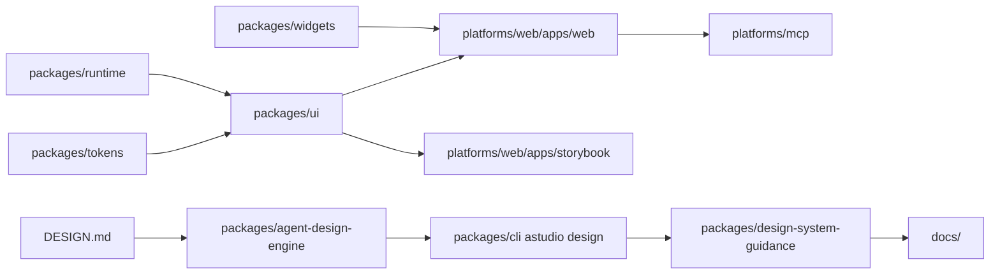

# FORJAMIE — design-system

## Table of Contents

- [Status](#status)
- [TL;DR](#tldr)
- [Architecture & data flow](#architecture--data-flow)
- [Codebase map](#codebase-map)
- [What's done / what's not](#whats-done--whats-not)
- [How to run locally](#how-to-run-locally)
- [How to test](#how-to-test)
- [Learnings & gotchas](#learnings--gotchas)
- [Weaknesses & improvements](#weaknesses--improvements)
- [Recent changes](#recent-changes)

## Status

<!-- STATUS_START -->
**Last updated:** 2026-05-02
**Production status:** IN_PROGRESS overall; Agent Design Prepare north-star plan is REVIEW_GREEN
**Overall health:** Yellow overall; Green for the Agent Design Prepare plan lane

| Area | Status | Notes |
| --- | --- | --- |
| Build / CI | Yellow | Focused policy, token, matrix, docs, guidance, whitespace, browser, widget a11y, and aggregate build gates pass for the Agent Design Engine slice |
| Tests | Yellow | Agent-design and release-readiness gates pass (`agent-design-engine`, `cli`, `design-system-guidance`, web E2E, widget a11y, and root build), including fixture-backed CLI JSON/recovery/migration coverage |
| Agent Design Prepare plan | Merged into the current simplification lane | The prepare contract and changed-surface evidence gate are now the foundation for PR #161's agent-first simplification and review-thread fixes |
| Security | Clean | 13 CVEs patched; GitHub Actions SHA-pinned |
| Open PRs | 1 | PR #161 carries the agent-first simplification slice and current review-thread fixes |
| Blockers | None | |
<!-- STATUS_END -->

## TL;DR

This monorepo is the aStudio design system and Apps SDK UI foundation. It ships reusable token, UI, runtime, icon, and widget packages, plus example web and Storybook surfaces and an MCP integration harness so downstream apps can build consistent ChatGPT-style experiences.

`DESIGN.md` is now the repo-level agent UI contract. Coding agents can use `astudio design ...` to lint, diff, export, initialize, migrate, and diagnose the contract before generating UI, while `packages/agent-design-engine` owns the semantic parsing and rule provenance behind those commands.

## Architecture & data flow


```mermaid
flowchart LR
  Tokens["packages/tokens"] --> UI["packages/ui"]
  Runtime["packages/runtime"] --> UI
  UI --> Web["platforms/web/apps/web"]
  UI --> Storybook["platforms/web/apps/storybook"]
  Widgets["packages/widgets"] --> Web
  Web --> MCP["platforms/mcp"]
  DesignMd["DESIGN.md"] --> Engine["packages/agent-design-engine"]
  Engine --> CLI["packages/cli astudio design"]
  CLI --> Guidance["packages/design-system-guidance"]
  Guidance --> Docs["docs/"]
```

- `packages/tokens` generates the design primitives and semantic variables that feed the UI layer.
- `packages/ui` is the primary React component library consumed by the web app, Storybook, and widget surfaces.
- `packages/runtime` provides host adapters and environment wiring for embedded and standalone usage.
- `packages/widgets` packages standalone widget bundles used by the web surface and MCP integration paths.
- `platforms/mcp` contains the MCP integration harness and tool contract tests.
- `packages/design-system-guidance` packages the policy and guidance checks used to keep downstream consumers aligned, including repo-scoped protected-surface enforcement and an exemption ledger.
- `packages/design-system-guidance` findings now carry agent-facing remediation metadata when deterministic recovery is available: replacement instructions, copyable examples, read-only validation commands, and proposal-required reasons when the tool should not guess.
- `packages/agent-design-engine` parses `DESIGN.md`, computes professional-UI rule provenance, lints semantic UI contract requirements, diffs design contracts, and exports agent-readable token/contract payloads.
- `pnpm agent-design:lint` is the clean-checkout-safe root lint wrapper. It builds `packages/agent-design-engine` and `packages/cli` before invoking `packages/cli/dist/index.js`, so direct `dist` execution does not depend on tracked build artifacts.
- `packages/cli` exposes the engine through `astudio design` commands while keeping the existing `astudio.command.v1` JSON envelope for agents.
- `packages/design-system-guidance` now accepts additive `designContract` rollout state and migration metadata while preserving legacy v1 guidance fields. Its migration path enforces the command transition table and authenticates rollback metadata before any writable rollback or resume side effect.

## Codebase map

- `packages/ui/` contains the core React components, styles, integrations, and Vitest coverage for the public UI library.
- `packages/tokens/` owns token generation, validation, and the source-of-truth design primitives.
- `packages/runtime/` contains host adapters and runtime abstractions shared by UI consumers.
- `packages/agent-design-engine/` owns the `DESIGN.md` semantic engine, rule manifest, parity fixtures, and engine tests.
- `packages/widgets/` contains embeddable widget bundles and a11y coverage for widget delivery.
- `platforms/web/apps/web/` is the primary development surface for exercising the design system in a real app shell.
- `platforms/web/apps/storybook/` is the component documentation and visual verification surface.
- `platforms/mcp/` contains the MCP server integration harness and contract tests.
- `docs/` holds architecture, adoption, rollout, and governance guidance.
- `docs/specs/2026-04-28-agent-native-design-system-spec.md` is the deepened HE spec for turning the current agent-readable design-system contract into an agent-native preparation, routing, context-pack, remediation, example, and abstraction-proposal workflow.
- `docs/specs/2026-04-30-agent-design-prepare-north-star-spec.md` is the focused north-star spec that makes `astudio design prepare --surface <path> --json` the required pre-edit UI contract for agents, including semantic token guidance, deterministic error codes, schema hardening, safe validation commands, source evidence, proposal-required stops, interface alternatives, token source priority, and first-plan sequencing.
- `docs/specs/2026-05-02-agent-first-design-system-simplification-spec.md` provides the HE simplification spec for keeping the agent-design spine intact while reducing repo bulk, clarifying active authority, adding agent-ergonomic prepare affordances, resolving prototype/package taxonomy, and splitting large implementation files by responsibility.
- `docs/plans/2026-04-28-agent-native-design-system-plan.md` is the execution plan for that spec, split into contract wiring, routing-table, prepare-payload, CLI, remediation, gold-example, and proposal-gate slices.
- `docs/plans/2026-04-30-agent-design-prepare-north-star-plan.md` is the focused execution plan for making `prepare` the real north-star command: first prove the build-backed wrapper dependency chain and read-only distinction, then harden the prepare schema and fixture harness, add semantic token-contract loading, complete the payload, map deterministic errors, flip the docs front door, and keep human inspector/gold-example expansion deferred until they have evidence.
- `docs/plans/2026-05-02-agent-first-design-system-simplification-plan.md` remains the active HE delivery plan for the simplification spec. It starts with authority mapping and reference audits, then sequences prepare ergonomics, derived brief/PR-evidence formats, responsibility splits, package taxonomy, root script simplification, and `FORJAMIE.md` compression.
- `docs/design-system/GOLD_EXAMPLES.json` is the machine-readable gold-example inventory for promoted agent examples, state coverage, validation commands, and explicitly deferred non-promotable categories.
- `docs/design-system/proposals/` is the proposal-gate surface for new agent UI abstractions. It holds the proposal template, typed waiver registry, and docs for when enforced routes or uncovered canonical lifecycle promotions need accepted design evidence.
- `docs/architecture/COMMAND_SURFACE.md` is the current command-routing map. It keeps canonical agent-design, repo health, product-surface, specialist, and compatibility commands in one place so README, workflow docs, and this handoff do not grow competing script inventories.
- `scripts/` holds build, validation, drift-check, onboarding, and release tooling.
- Consumer projects should import `@design-studio/ui/styles.css` as the public stylesheet entry; internal style subpaths are implementation details and raw `file:` installs of `packages/ui` are not a supported external adoption path.

## What's done / what's not

| Area | State | Notes |
| --- | --- | --- |
| Core package structure | Done | Tokens, UI, runtime, widgets, icons, and MCP/web surfaces are all established |
| Adoption and guidance docs | Done | Onboarding command center, release docs, and governance docs exist |
| Guidance package | Done | `@brainwav/design-system-guidance` now supports repo-scoped `error`/`warn`/`exempt` enforcement, path specificity, and exemption-ledger validation |
| Agent design engine | Initial vertical slice done | `@brainwav/agent-design-engine` parses/lints/diffs/exports `DESIGN.md` and records rule-source provenance for agent UI work |
| aStudio design CLI | Initial vertical slice done | `astudio design lint/diff/export/check-brand/init/migrate/doctor` is available with schema-backed JSON envelopes, one-line stdout fixtures, and write gates |
| Quality debt radar | Warn-first baseline active | `pnpm quality-debt:check` validates the category/source contract, `pnpm quality-debt:report` generates weekly burn-down snapshots, and CI/release workflows run the radar as warn-first evidence |
| Protected settings migration | In progress | The initial settings wave is migrated onto shared shell/composition patterns, with explicit state stories and jsdom exemplar tests for the protected settings slice; broader app/storybook warn backlog remains intentionally non-blocking |
| Visual regression workflow | In progress | Root visual scripts now route through `scripts/run-playwright-suite.mjs` and `packages/ui build:visual`, and the exemplar gate now covers both the template browser shell and an isolated template-widget shell route |
| Current dependency hygiene | In progress | This change-set pins `vitest-axe` back to `1.0.0-pre.3` for deterministic installs |
| Long-term debt cleanup | In progress | Lint, icon a11y, and docs maintenance remain ongoing work |

## How to run locally

```bash
pnpm install
pnpm dev
pnpm dev:storybook
pnpm build
pnpm agent-design:lint
```

## How to test

```bash
pnpm test
pnpm lint
pnpm docs:lint
pnpm typecheck
pnpm format:check
pnpm build
pnpm test:policy
pnpm --silent agent-design:prepare --surface <path>
pnpm agent-design:prepare:changed
pnpm agent-design:lint
pnpm agent-design:type-check
pnpm agent-design:test
```

Use `docs/architecture/COMMAND_SURFACE.md` for the full command map, including product-surface gates, specialist policy checks, compatibility aliases, and fixture-only commands. Keep `docs:lint` as the canonical docs command; `doc:lint` is compatibility only.

The visual suites now go through `scripts/run-playwright-suite.mjs`, which prebuilds `packages/ui` with `pnpm -C packages/ui build:visual` before handing the remaining args straight to Playwright. Use that path when you need reliable `--list`, `--grep`, or `--update-snapshots` behavior from the root scripts without leaving the package in a declaration-broken state.
The web e2e and widget a11y Playwright configs bind dev servers to `127.0.0.1` by default via `PLAYWRIGHT_WEB_HOST` / `PLAYWRIGHT_WIDGETS_HOST`. Keep that explicit host when changing the suites; relying on Vite's default `localhost` resolution can drift to `::1` and fail in sandboxed Codex runs with `listen EPERM`.
The policy-owned exemplar slice now has its own root entry points. Use `pnpm test:exemplar-evaluation:list` to inspect the exact protected Storybook checks, and `pnpm test:exemplar-evaluation:update` to refresh only those baselines instead of hand-copying long `PLAYWRIGHT_STORYBOOK_*` env strings. `TemplateBrowserPage` is now part of the always-on exemplar slice, but that browser-backed check runs as an explicit exemplar gate rather than as part of the browser-free `pnpm test:policy` contract.
For template-family QA, use `/templates` for the searchable browser shell and `/template-widget/<template-id>` for the isolated single-template widget shell that mirrors widget-style rendering without needing `VITE_TEMPLATE_ID`.
Committed visual baselines live under `tests/visual/__snapshots__`. Local Playwright HTML reports, nested Vite cache outputs under `node_modules/.vite`, nested `.tmp` build scratch files, Storybook screenshot captures, package/app `dist` outputs, and ad hoc `reports/audit-*` outputs are now gitignored so browser and build runs stop polluting the branch.

## Learnings & gotchas

See also: `~/.codex/instructions/Learnings.md`

- Keep `FORJAMIE.md` detailed and current whenever behavior, structure, config, or tooling changes.
- Pre-release dependencies should stay pinned when the repo depends on exact lockfile behavior across workspaces.
- Use the repo preflight helper before path-sensitive or multi-step git workflows.
- Guidance-policy exemptions must stop applying the moment they expire; otherwise CI reports the ledger drift but still hides the real surface-level rule failure that needs cleanup.
- Local Memory preflight probes need to honor the configured `rest_api.host` for every REST smoke request, not just health checks, or valid non-loopback setups look broken.
- The exemplar-evaluation gate depends on Playwright browser binaries being installed locally; if `pnpm test:exemplar-evaluation` fails before running tests, verify Chromium is provisioned for Playwright in this environment. `pnpm test:policy` should stay browser-free so pre-Playwright CI and release workflows do not fail on unrelated changes.
- `TemplateWidgetPage` only rendered during `VITE_TEMPLATE_ID` widget builds before this slice. The stable runtime route for browser QA is now `/template-widget/<template-id>`, which gives the web visual suite a deterministic way to protect the isolated widget shell.
- Protected settings stories are inside the same repo-governed surface family as the app panels, so even Storybook-only scaffolding should avoid literal background hex values or other policy escapes that would add noisy guidance debt.
- `TemplateBrowserPage` is now part of the default exemplar gate. If `pnpm test:exemplar-evaluation` fails on the template-browser slice, treat that as a real always-on page regression rather than an opt-in baseline workflow.
- The root visual scripts are now the canonical entry point for listing or filtering Playwright coverage. They use the `packages/ui build:visual` path, which preserves declaration output while still avoiding the earlier visual-only typegen noise from internal Storybook demo code.
- Web e2e and widget a11y Playwright web servers should bind `127.0.0.1` unless a caller explicitly overrides `PLAYWRIGHT_WEB_HOST` or `PLAYWRIGHT_WIDGETS_HOST`. In sandboxed Codex runs, Vite's default `localhost` can resolve to `::1` and fail before any browser assertion runs.
- The guidance CLI now supports `--json` for policy tooling, and large guidance payloads must be flushed before exit. If a future automation sees truncated JSON around 64 KB, check the CLI output path before blaming the policy consumer.
- If Storybook or web visual runs suddenly explode into dozens of identical Playwright launch failures, the likely problem is a missing local browser binary rather than dozens of broken stories. The suite wrapper now preflights Chromium for non-`--list` runs and prints the single remediation command.
- If you need to refresh the protected settings exemplar baselines, do not paste the long `PLAYWRIGHT_STORYBOOK_STORY_IDS=...` command by hand. Use `pnpm test:exemplar-evaluation:update` so the update path stays aligned with the policy runner's canonical `components-settings-*` story IDs.
- Storybook screenshot URLs must set both `globals.theme` and `backgrounds.value`, and they must derive their base URL from `PLAYWRIGHT_STORYBOOK_BASE_URL` / `PLAYWRIGHT_STORYBOOK_PORT` instead of hard-coding `localhost:6006`. Otherwise “light” screenshots can silently render the dark theme, and reused non-default Storybook servers will fail.
- Storybook visual captures now disable Agentation and Dialkit overlays by URL flag during Playwright runs. If a visual failure suddenly shows the MCP/annotation panel inside the screenshot, the preview/test URL contract has drifted and should be repaired before blessing any baseline.
- Storybook visual regression now runs single-worker with a 90s test timeout. That is intentional: the settings exemplar slice proved flaky under local parallel capture and late dark-theme sweeps, so determinism now wins over speed for this gate.
- Storybook visual captures now pin Playwright to `en-US` / `UTC`, and fullscreen exemplar stories are forced onto the exact `1280x720` capture surface inside the spec harness. If Ubuntu-only screenshot drift shows up on chat/settings fullscreen stories, check the visual harness before re-blessing baselines.
- The exemplar visual gate now belongs to the macOS build lane in CI, not the Ubuntu web lane. The committed Storybook/fullscreen baselines are currently mac-recorded, so running the always-on exemplar check on macOS keeps the gate trustworthy while Linux still handles policy/build coverage.
- Storybook dev must ignore Playwright artifact paths during visual runs. If the server starts reloading or dropping mid-capture, check `.storybook/main.ts` first and confirm `playwright-report`, `test-results`, and `__snapshots__` are excluded from Vite watch globs so the visual gate is not watching its own outputs.
- The touched-file ratchet must include untracked files via `git ls-files --others --exclude-standard`, not just tracked diffs. Otherwise a brand-new protected-surface file can dodge the ratchet until it is staged.
- Keep the committed visual baselines, but ignore local runtime artifacts. The repo now explicitly ignores nested `node_modules/.vite`, nested `node_modules/.tmp`, Playwright HTML reports, and `reports/audit-*` outputs so UI verification runs do not turn branch state into cache noise.
- Design command outputs go through the same masking path as other `astudio` JSON envelopes. If agent consumers need raw token payloads for a safe local export, use the dedicated `design export` artifact path and validate the resulting JSON before handing it to downstream tooling.
- The migration transition table should run before rollback metadata lookup. That keeps invalid state/operation pairs as `E_DESIGN_MIGRATION_STATE_INVALID` no-op failures, while metadata readability tests must start from rollback-eligible states such as `design-md/active`, `partial`, or `failed`.
- Rollback metadata authentication is intentionally local-artifact bound rather than a remote signing service in this pre-GA slice. Treat the rollback artifact signing key, `metadataDigest`, `metadataSignature`, path-root checks, config checksums, and `DESIGN.md` checksums as one fail-closed contract: if any piece drifts, rollback/resume must exit `3` without mutation.
- The `DESIGN.md` engine computes source digests from `docs/design-system/PROFESSIONAL_UI_CONTRACT.md`, `AGENT_UI_ROUTING.md`, `COMPONENT_LIFECYCLE.json`, and `COVERAGE_MATRIX.json`. If any of those files move or become unreadable, design lint/export should fail before semantic evaluation.
- Gold examples are intentionally narrower than the full component catalog. `GOLD_EXAMPLES.json` should promote only existing source/story/test paths, and missing categories must stay `promotable: false` until a protected fixture and read-only validation command exist.
- Proposal waivers are typed, expiring design debt records rather than comments. If `pnpm agent-design:proposals` fails, either backfill an accepted proposal under `docs/design-system/proposals/` or replace the waiver with real lifecycle coverage before promoting another route.
- Agent design manifest readers must treat repo JSON as untrusted input. Guidance config, route refs/examples, lifecycle rows, waiver registries, and coverage matrix rows now fail closed on malformed shape instead of silently falling back to empty data or lookup misses.
- Agent design `prepare` payloads deliberately omit ambient timing from the canonical public contract. Keep execution timing in wrapper logs, CI evidence, or local test harnesses so downstream agents only depend on deterministic payload fields.
- Route surface matching is metadata-owned through `docs/design-system/AGENT_UI_ROUTING.json`. If a route starts resolving to the wrong primitive, fix the authored `surfacePatterns` or the glob specificity logic instead of adding another hard-coded surface branch.
- `DESIGN.md` schema versions are fail-closed. The v1 engine only accepts `schemaVersion: agent-design.v1`; future contract versions must add explicit parser/rule-pack support before `lint` or `export` can proceed.
- `DESIGN.md` section line numbers must stay anchored to the original file, including YAML frontmatter. Lint findings use those lines as agent remediation evidence.
- `astudio design init` validates the starter contract before writing, but it must still enforce the write gate first so a missing `--write` remains a policy error instead of a provenance error.
- Package-level Biome scripts need to use the same pinned Biome 2.x command as the root scripts. The workspace still contains older Biome 1.x dependencies for other packages, and those cannot parse the current `biome.json` schema.
- Browser-backed Playwright gates need a provisioned Chromium cache and a macOS launch path that is not blocked by the Codex sandbox. If every browser test fails at launch with `bootstrap_check_in ... Permission denied (1100)`, treat it as an environment permission issue and rerun the browser gate through the approved unsandboxed path before debugging UI code.
- Package manifests can point at `dist` in `main`, `types`, `exports`, `bin`, or `files`, but those generated outputs are no longer committed source. Build before pack, publish, or direct `node packages/*/dist/...` execution.
- `pnpm generated-source:check` is the canonical freshness gate for tracked generated runtime inputs. It regenerates the web template registry, widget JavaScript manifest, and Cloudflare worker manifest, formats the tracked generated source with Biome 2.3.11, and fails if the committed snapshot is stale.
- `packages/widgets/src/sdk/generated/widget-manifest.ts` is still an ignored mutable local mirror. The tracked runtime authority is `packages/widgets/src/sdk/generated/widget-manifest.js`, and Cloudflare consumes its own deterministic `src/worker/widget-manifest.generated.ts` mirror after `pnpm -C packages/cloudflare-template run prebuild`.
- Workspace package scripts should prefer `node --import tsx ...` when they depend on hoisted `tsx`; bare package-local `tsx` shims have already failed in this workspace layout.
- `docs/plans/README.md`, `reports/README.md`, and `artifacts/reviews/README.md` are now the authority indexes for plan, report, and review-evidence routing. Prefer those front doors before trusting filename recency or old embedded status text.
- `pnpm tracked-ignored:check` is the guard that keeps ignored runtime, cache, test-output, build-output, and ad hoc audit artifacts from becoming tracked again. It allows the documented planning/config exceptions, so do not replace it with a blanket ban on every `git ls-files -ci --exclude-standard` result.
- `docs:lint` is the canonical docs quality command; `doc:lint` is only a compatibility alias. Theme propagation has an active property-test surface at `pnpm test:theme-propagation`, and the tree-shaking prototype is intentionally retained behind `pnpm validation-prototype:build`.
- `docs/architecture/PACKAGE_TAXONOMY.md` is the current package lifecycle authority. It classifies `packages/effects` as a first-class product package included in root `pnpm typecheck`, keeps `packages/cloudflare-template` and `packages/astudio-make-template` as template packages under `packages/`, keeps `packages/validation-prototype` as a validation fixture behind explicit scripts, and keeps `apps/` as README-only navigation pointers to canonical `platforms/**` app paths.
- Rollback quarantine recovery depends on preserving `design-md/partial` until the quarantine move succeeds. Switching to `legacy/partial` before removing `DESIGN.md` strands retry paths because authenticated metadata still expects the design file and active/partial config checksums.

## Weaknesses & improvements

- Dependency drift can still show up as lockfile-only noise; keep package specifiers aligned with the lockfile when pre-release packages are involved.
- `FORJAMIE.md` had started drifting toward a placeholder template; keep it as a real project map, not just a status shell.
- The repo still carries known lint and accessibility debt that should be paid down incrementally as touched areas are updated.
- Cross-project adoption used to look more flexible than it really was; keep README and checklist guidance aligned with the actual exported package surface and supported install modes.
- Design-system trust is weaker than it should be because token validation and coverage freshness can fail while broader policy checks still pass; align root policy with semantic-slot and design-system integrity rules before asking agents to generate more product UI.
- The repo-wide guidance command now passes, but it still reports a large `warn` backlog across reusable UI, storybook, and showcase surfaces. That backlog is visible by design and should be ratcheted down incrementally instead of hidden.
- The web and Storybook visual suites are finally deterministic enough to build on, and the first touched-file ratchet is now in place for the initial protected surface set. The remaining work is widening that ratchet gradually without turning warning debt back into hidden drift.
- The first touched-file ratchet now covers the full settings panel/story family, the touched forms component slice, and app pages including both template pages. It should keep expanding gradually, but only after adjacent surfaces stay clean long enough that the next boundary is believable.
- `packages/ui` still carries some internal Storybook `_holding` demo code that looks like package-consumer code. Keep that material out of declaration generation, or it will reintroduce self-import type noise into otherwise healthy package builds.
- `packages/tokens/src/shadows.ts` is generated, but it cannot be a pure mirror of the DTCG shadow source. The DTCG file only defines the legacy `card/pip/pill/close` map; the generated TypeScript layer must also re-emit the semantic `elevation` API and `ElevationToken` type or `packages/tokens/src/index.ts` will compile locally until the next `pnpm generate:tokens`, then break in CI.
- The first `agent-design-engine` slice is intentionally semantic and deterministic, but it is not yet a full AST-aware UI reviewer. It catches missing contract concepts, not every bad JSX or CSS pattern an agent might write.
- `astudio design migrate` now enforces its state transition table, writes authenticated rollback metadata, checks rollback paths and file checksums before mutation, marks crash-recoverable `partial` state before final mutation, and quarantines migrated `DESIGN.md` files during rollback. Quarantine paths are collision-safe and covered by repeated rollback/remigration plus concurrent-writer race tests; remaining pre-GA migration hardening should focus on support-window compatibility fixtures and explicit idempotency edge cases.
- `astudio design check-brand --strict` now has non-tautological mismatch logic, but only `astudio-default@1` is currently supported. Add a second supported profile fixture before treating cross-profile mismatch behavior as fully proven.
- `pnpm generated-source:check` intentionally rebuilds widget assets and may print Vite chunk-size warnings. Treat it as a correctness/freshness gate, not as the package performance budget.
- `pnpm agent-design:boundaries` is the ownership tripwire for the Agent Design Engine: wrappers can call public package exports, but parser, lint, diff, export, and profile-comparison implementation must stay in `packages/agent-design-engine`.
- `pnpm agent-design:proposals` now blocks silent enforced-route and uncovered lifecycle promotion, but the first waiver registry intentionally grandfathered existing ProductComposition and ChatShell gaps. Those waivers should be replaced by accepted proposal records or per-export coverage before expiry.
- `@brainwav/design-system-guidance` imports the public `@brainwav/agent-design-engine` package export, whose package types resolve through `dist`. Its build and type-check scripts must build the sibling engine package first, or clean CI installs can fail before the guidance checks run.
- `pnpm --silent agent-design:prepare --surface <path>` depends on built `packages/agent-design-engine`, `packages/design-system-guidance`, and `packages/skill-ingestion` artifacts because the CLI imports those workspace packages through package exports. Keep it aligned with `pnpm agent-design:lint` by building those packages before building the CLI. The wrapper appends `--json` itself and does not include a default surface; callers provide `--surface` explicitly. The wrapper is build-backed convenience; the read-only contract belongs to the underlying `astudio design prepare` operation once the CLI is available. Use `--silent` whenever an agent or script captures JSON, because plain `pnpm` writes lifecycle banners to stdout.
- `pnpm agent-design:prepare:changed` is the agent-first PR/local evidence gate. It builds the prepare dependencies, discovers changed `.tsx`/`.jsx` UI surfaces under the protected app/widget trees, runs the read-only CLI prepare operation for each surface, and fails closed when a payload is unsafe, incomplete, unparseable, or points outside the repository. Use `-- --surface <path>` to force a single-surface check. GitHub Actions also runs this gate on pull requests in the web platform lane with `AGENT_DESIGN_PREPARE_BASE` pointed at the PR base ref.
- `docs/guides/AGENT_DESIGN_WORKFLOW.md` is the detailed workflow authority for protected UI edits. `README.md` is the short repo front door, and this file is the durable project map; avoid restating the whole workflow in all three places.
- `pnpm quality-debt:report` is warn-first by design. Amber/red radar posture is release-owner evidence, not a new hard-fail gate, until explicit thresholds are approved.
- Quality-debt radar CLI output now includes `service:"quality-debt-radar"` on status/error lines, and flag parsing fails fast when `--output`, `--date`, or `--week` are missing values.
- The next agent-native design-system hardening lane is specified broadly in `docs/specs/2026-04-28-agent-native-design-system-spec.md` and narrowed by `docs/specs/2026-04-30-agent-design-prepare-north-star-spec.md`. The north-star rule is that no protected UI change is ready until `astudio design prepare --surface <path> --json` returns `safeForAutomaticImplementation: true`, or the PR explains the proposal/manual decision required. The focused execution source for this lane is now `docs/plans/2026-04-30-agent-design-prepare-north-star-plan.md`; use the older `docs/plans/2026-04-28-agent-native-design-system-plan.md` only for broader historical context and adjacent non-prepare slices.

## Recent changes

### 2026-05-03

- **Unslopify quality evidence refresh**: ran the `unslopify` cleanup audit path across the current repo-owned cleanup gates, refreshed the Apps SDK upstream alignment stamp from a passing `pnpm test:drift` run, and generated the current weekly quality-debt report. The report remains warn-first: it is release-owner evidence, not a new hard-fail gate.
- **Disabled Biome rule ratchet**: renamed the quality-debt radar category from ambiguous “lint suppressions” language to `Disabled Biome rules`, promoted 15 previously disabled Biome rules back into active lint coverage, and fixed the resulting lint errors/warnings in chart styles, sidebar cookie persistence, story exports, generated icon locals, widget entrypoints, widget state fallbacks, icon catalog filtering, map refs, migration/drift scripts, token watcher logging, and remote skill ingestion. The generated weekly report now shows 19 disabled linter rules remaining, down from 34.

### 2026-05-02

- **PR #161 review-thread fixes**: tightened the derived `astudio design prepare` formats so CI refuses `--format brief` and `--format pr-evidence` instead of emitting non-JSON contract output, made route confidence/example maturity depend on registered gold-example evidence, and added `nextAction.reasonCode`, route confidence, forbidden-patterns, and stricter validation-command typing to the brief, PR-evidence, schema, and payload surfaces. The same fix pass hardened `packages/effects` scroll and tilt components by clamping fallback progress/tilt values, resetting invalid selector progress, preserving TOC marker style override precedence, sanitizing `hoverScale`, and removing inline style assertions. It also added `pnpm validation-prototype:ban-check` and wired it into `pnpm test:policy` so product code cannot import the validation fixture; the guard now checks real import/export/require/dynamic-import specifiers and package dependency fields instead of raw text mentions. Gold-example parsing now trims and rejects blank `sourcePath`, `purpose`, and state values, and validation-command `ifFails` guidance now trims blanks back to the deterministic default remediation text. Validation evidence for the focused fixes includes `pnpm -C packages/agent-design-engine test`, `pnpm -C packages/cli test`, `pnpm -C packages/effects test`, and `pnpm validation-prototype:ban-check`.
- **Agent-first simplification spec**: added and deepened `docs/specs/2026-05-02-agent-first-design-system-simplification-spec.md` to turn the project critique into a planning-ready HE spec. The spec keeps `astudio design prepare --surface <path> --json` as the canonical agent pre-edit contract, preserves the current engine/CLI/guidance/UI spine, and defines the cleanup lane around active authority mapping, historical docs/review/report classification, prepare ergonomics (`nextAction`, `doNotInvent`, route confidence, example usage guidance, validation failure guidance, `prepare --format brief`, `prepare --format pr-evidence`), large-file responsibility splits, package taxonomy decisions for prototypes/effects/templates, root script simplification, and `FORJAMIE.md` compression. The deepening pass selected a payload-first interface shape so brief and PR-evidence output must be generated from the typed prepare payload rather than a second data path.
- **Agent-first simplification plan**: added `docs/plans/2026-05-02-agent-first-design-system-simplification-plan.md` as the HE execution plan for the simplification spec. The plan keeps the first work packet on authority-map and reference-audit cleanup, then sequences prepare ergonomics, derived brief/PR-evidence formats, large-file responsibility splits, package taxonomy decisions, script cleanup, and `FORJAMIE.md` compression. P0 validation now consistently requires `pnpm docs:lint`, `pnpm test:policy`, and `git diff --check` across the plan and source spec. The plan is linked to completed Linear issue JSC-238 for the upstream agent-native design-system command layer; no newer simplification-specific Linear acceptance map has replaced it.
- **Agent-first simplification P0 authority map**: promoted the simplification plan from proposed to active after the HE heartbeat was created, made `docs/guides/AGENT_DESIGN_WORKFLOW.md` the detailed agent UI workflow authority, shortened README/FORJAMIE duplication into pointers, refreshed the plans/reports/review-artifact indexes, and recorded hidden-path reference audits for `.spec/**`, `.kiro/**`, `ai/**`, older plans/specs, reports, and review artifacts before any archive/delete work.
- **Agent-first simplification P1 prepare ergonomics**: extended the `astudio.design.prepare.v1` payload so agents get explicit `nextAction`, `doNotInvent`, route confidence evidence, route example usage guidance, and validation-command `ifFails` triage before editing UI. The change keeps the existing `relevantExamples: string[]` compatibility field, adds schema coverage for the new payload fields, and keeps validation commands bound to the existing read-only package-script trust path. The focused P1 evidence is recorded in `docs/plans/2026-05-02-agent-first-design-system-simplification-plan.md`.
- **Agent-first simplification P2 derived prepare formats**: added `astudio design prepare --surface <path> --format brief` and `--format pr-evidence` as text renderings generated from the typed `PreparePayload`. JSON remains the canonical machine contract; text formats reject `--json`/`--agent` combinations so agents do not mistake derived prose for the stable contract. README and the agent workflow guide now document these formats as human-review and PR-handoff helpers, not replacements for `--json`.
- **Agent-first simplification P3 prepare renderer split**: moved the derived prepare text renderers out of `packages/agent-design-engine/src/prepare.ts` into `packages/agent-design-engine/src/prepare/brief.ts`, `packages/agent-design-engine/src/prepare/pr-evidence.ts`, and shared `packages/agent-design-engine/src/prepare/text.ts`. Public exports stay stable through `packages/agent-design-engine/src/index.ts`, so CLI callers still import and render the same brief/PR-evidence behavior while `prepare.ts` stays focused on payload construction. The phase also fixed the package-local `packages/design-system-guidance` `check` / `check:ci` scripts so package-scoped validation scans the repository root instead of treating the guidance package directory as the repo root.
- **Agent-first simplification P4 package taxonomy**: added `docs/architecture/PACKAGE_TAXONOMY.md` as the current lifecycle authority for product libraries, template packages, validation fixtures, and navigation indexes. `packages/effects` now passes its package-local typecheck and root `pnpm typecheck` includes it again; the template packages stay under `packages/` with an explicit generated-source/version-sync/deployment-docs rationale; `packages/validation-prototype` remains a validation fixture behind root scripts; and `apps/` remains a README-only pointer index.
- **Agent-first simplification P5 command surface and FORJAMIE compression**: moved older detailed recent-change history into `docs/changelog/FORJAMIE_HISTORY.md`, added `docs/architecture/COMMAND_SURFACE.md` as the command-routing authority, and shortened this handoff's testing section to the canonical repo/agent-design gates plus a pointer to the full command map. Compatibility aliases such as `doc:lint` remain classified instead of deleted while active historical references still exist.
- **PR #159 merge conflict resolution**: rebased the changed-surface evidence gate onto the merged Agent Design Prepare hardening from `main`. The branch now keeps the newer prepare parser/schema/token-contract behavior from `main`, while preserving `pnpm agent-design:cli:prebuild`, `pnpm agent-design:prepare:changed`, the web CI evidence step, PR template checklist, README/workflow docs, and CLI tests that prove the gate builds the prepare stack before checking changed protected UI surfaces.


Older detailed change history moved to [docs/changelog/FORJAMIE_HISTORY.md](docs/changelog/FORJAMIE_HISTORY.md).

---
<!-- MACHINE_READABLE_START
project: design-system
repo: ~/dev/design-system
status: IN_PROGRESS
health: yellow
last_updated: 2026-05-02
open_prs: 1
blockers: none
next_milestone: Agent Design Prepare PR review and merge
next_milestone_date: 2026-05-03
MACHINE_READABLE_END -->
