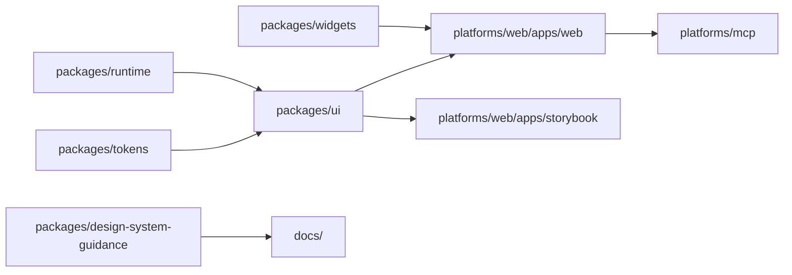

# FORJAMIE — design-system

## Table of Contents

- [Status](#status)
- [TL;DR](#tldr)
- [Architecture & data flow](#architecture--data-flow)
- [Codebase map](#codebase-map)
- [What's done / what's not](#whats-done--whats-not)
- [How to run locally](#how-to-run-locally)
- [How to test](#how-to-test)
- [Learnings & gotchas](#learnings--gotchas)
- [Weaknesses & improvements](#weaknesses--improvements)
- [Recent changes](#recent-changes)

## Status

<!-- STATUS_START -->
**Last updated:** 2026-03-10
**Production status:** IN_PROGRESS
**Overall health:** Needs attention

| Area | Status | Notes |
| --- | --- | --- |
| Build / CI | Green baseline | `origin/main` was green before this local change-set |
| Tests | Needs re-run | Re-run after dependency pin/doc sync in this change-set |
| Open PRs | 0 | No open PRs before this workflow |
| Blockers | None | Local repo state only |
<!-- STATUS_END -->

## TL;DR

This monorepo is the aStudio design system and Apps SDK UI foundation. It ships reusable token, UI, runtime, icon, and widget packages, plus example web and Storybook surfaces and an MCP integration harness so downstream apps can build consistent ChatGPT-style experiences.

## Architecture & data flow


```mermaid
flowchart LR
  Tokens["packages/tokens"] --> UI["packages/ui"]
  Runtime["packages/runtime"] --> UI
  UI --> Web["platforms/web/apps/web"]
  UI --> Storybook["platforms/web/apps/storybook"]
  Widgets["packages/widgets"] --> Web
  Web --> MCP["platforms/mcp"]
  Guidance["packages/design-system-guidance"] --> Docs["docs/"]
```

- `packages/tokens` generates the design primitives and semantic variables that feed the UI layer.
- `packages/ui` is the primary React component library consumed by the web app, Storybook, and widget surfaces.
- `packages/runtime` provides host adapters and environment wiring for embedded and standalone usage.
- `packages/widgets` packages standalone widget bundles used by the web surface and MCP integration paths.
- `platforms/mcp` contains the MCP integration harness and tool contract tests.
- `packages/design-system-guidance` packages the policy and guidance checks used to keep downstream consumers aligned.

## Codebase map

- `packages/ui/` contains the core React components, styles, integrations, and Vitest coverage for the public UI library.
- `packages/tokens/` owns token generation, validation, and the source-of-truth design primitives.
- `packages/runtime/` contains host adapters and runtime abstractions shared by UI consumers.
- `packages/widgets/` contains embeddable widget bundles and a11y coverage for widget delivery.
- `platforms/web/apps/web/` is the primary development surface for exercising the design system in a real app shell.
- `platforms/web/apps/storybook/` is the component documentation and visual verification surface.
- `platforms/mcp/` contains the MCP server integration harness and contract tests.
- `docs/` holds architecture, adoption, rollout, and governance guidance.
- `scripts/` holds build, validation, drift-check, onboarding, and release tooling.

## What's done / what's not

| Area | State | Notes |
| --- | --- | --- |
| Core package structure | Done | Tokens, UI, runtime, widgets, icons, and MCP/web surfaces are all established |
| Adoption and guidance docs | Done | Onboarding command center, release docs, and governance docs exist |
| Guidance package | Done | `@brainwav/design-system-guidance` is present for downstream policy checks |
| Current dependency hygiene | In progress | This change-set pins `vitest-axe` back to `1.0.0-pre.3` for deterministic installs |
| Long-term debt cleanup | In progress | Lint, icon a11y, and docs maintenance remain ongoing work |

## How to run locally

```bash
pnpm install
pnpm dev
pnpm dev:storybook
pnpm build
```

## How to test

```bash
pnpm test
pnpm lint
pnpm format:check
pnpm build
pnpm test:deep
```

`test:deep` is expected by the broader Codex workflow when source or runtime behavior changes. If that script is unavailable or fails for an unrelated reason, record the exact outcome in the PR body.

## Learnings & gotchas

See also: `~/.codex/instructions/Learnings.md`

- Keep `FORJAMIE.md` detailed and current whenever behavior, structure, config, or tooling changes.
- Pre-release dependencies should stay pinned when the repo depends on exact lockfile behavior across workspaces.
- Use the repo preflight helper before path-sensitive or multi-step git workflows.

## Weaknesses & improvements

- Dependency drift can still show up as lockfile-only noise; keep package specifiers aligned with the lockfile when pre-release packages are involved.
- `FORJAMIE.md` had started drifting toward a placeholder template; keep it as a real project map, not just a status shell.
- The repo still carries known lint and accessibility debt that should be paid down incrementally as touched areas are updated.

## Recent changes

### 2026-03-10

- Added a root `pnpm.overrides` pin for `express-rate-limit@8.2.2` and refreshed `pnpm-lock.yaml` so the repo no longer resolves the Trivy-flagged `8.2.1` release pulled through `@modelcontextprotocol/sdk`.
- Pinned `packages/ui` `vitest-axe` from a floating pre-release range to exact `1.0.0-pre.3` and updated `pnpm-lock.yaml` to match. This reduces install drift and keeps the repo on the previously expected pre-release build instead of silently floating to `1.0.0-pre.5`.
- Restored `FORJAMIE.md` to a detailed project map with current run/test guidance so the repo satisfies its living-document gate in the same change-set.

### 2026-03-05

- Re-enabled the `risk-policy-gate` job in `.github/workflows/pr-pipeline.yml`, corrected its docs baseline step to `node scripts/check-doc-links.mjs`, and replaced the external coding-harness gate invocations with a repo-local helper at `scripts/harness_pr_pipeline.py`. This kept PR policy enforcement local to the repo instead of relying on unavailable private tooling.

### 2026-03-05

- Added the onboarding command center, task-first onboarding routes, and automated onboarding parity checks. This established a single authoritative onboarding path and automated drift detection for docs and setup guidance.

---
<!-- MACHINE_READABLE_START
project: design-system
repo: ~/dev/design-system
status: IN_PROGRESS
health: yellow
last_updated: 2026-03-10
open_prs: 0
blockers: none
next_milestone: ChatGPT widget integration
next_milestone_date: 2026-04-01
MACHINE_READABLE_END -->
