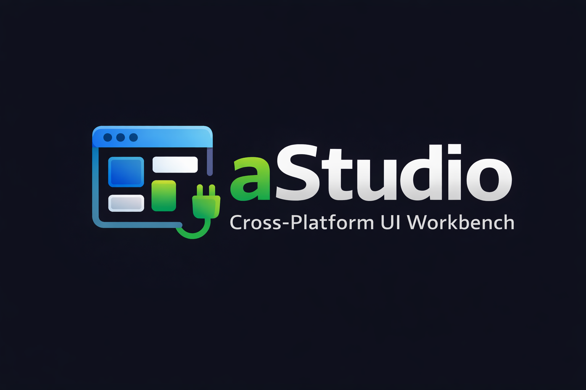

# aStudio

Cross-Platform UI Workbench

Last updated: 2026-01-09

## Doc requirements

- Audience: Developers (intermediate)
- Scope: Overview and essential workflows for this area
- Non-scope: Deep API reference or internal design rationale
- Owner: Platform Team (confirm)
- Review cadence: Quarterly (confirm)

This repository is a **library-first monorepo** for building consistent UI across ChatGPT widgets and standalone React applications.

## What This Is

A cross-platform UI workbench for building ChatGPT-style interfaces across multiple platforms:

- **ChatGPT Widgets** - Embedded widgets via OpenAI Apps SDK
- **React Applications** - Standalone web applications using `@design-studio/ui`
- **MCP Integration** - Model Context Protocol server for ChatGPT tool integration

## Primary Products

- `@design-studio/ui` - Reusable UI components (chat layout, header, sidebar, primitives)
- `@design-studio/runtime` - Host adapters + mocks (`window.openai` wrapper, HostProvider)
- `@design-studio/tokens` - Design tokens (CSS variables, Tailwind preset)
- `packages/widgets` - Standalone widget bundles for ChatGPT
- `packages/cloudflare-template` - Cloudflare Workers deployment template for MCP

## Development Surfaces

- `platforms/web/apps/web` - Widget Gallery for visual testing and MCP widget builds
- `platforms/web/apps/storybook` - Component documentation and interactive development
- `platforms/desktop/apps/desktop` - Desktop shell scaffold (Tauri placeholder)
- `platforms/mcp` - MCP server for ChatGPT integration

Note: `apps/` is a navigation index only; canonical app paths remain under `platforms/`.

## Contents

- [Prerequisites](#prerequisites)
- [Compatibility matrix](#compatibility-matrix)
- [Quick Start](#quick-start)
- [Onboarding Command Center](#onboarding-command-center)
- [Verify](#verify)
- [Common tasks](#common-tasks)
- [Widget Gallery & Development](#widget-gallery--development)
- [Documentation](#documentation)
- [Troubleshooting](#troubleshooting)
- [Rules of the road](#rules-of-the-road)
- [Apps SDK UI integration](#apps-sdk-ui-integration)
- [Foundation tokens (audit layer)](#foundation-tokens-audit-layer)
- [Host adapter seam](#host-adapter-seam)
- [Library exports](#library-exports)
- [Public API surface](#public-api-surface)
- [Public API policy](#public-api-policy)
- [Storybook navigation](#storybook-navigation)
- [Release & versioning](#release--versioning)
- [Using in Other Projects](#using-in-other-projects)
- [Creating New Components](#creating-new-components)
- [Development Workflow](#development-workflow)
- [Architecture](#architecture)

## Prerequisites

- Node.js 18+
- pnpm 10.28.0 (see `packageManager` in `package.json`)

## Compatibility matrix

- **React**: 19.x (required by `@design-studio/ui` peerDependencies)
- **TypeScript**: 5.9+ (workspace devDependency)
- **Node.js**: 18+ (runtime baseline)
- **Apps SDK UI**: ^0.2.1 (from `@design-studio/ui` dependencies)

## 🚀 Quick Start

```bash
# Install dependencies
pnpm install

# Start development
pnpm dev                    # Widget Gallery at http://localhost:5173
pnpm dev:web                # Widget Gallery only (http://localhost:5173)
pnpm dev:storybook          # Storybook only (http://localhost:6006)

# Build for production
pnpm build                 # Build pipeline (web packages)
pnpm build:web             # Web-only build
pnpm build:widgets         # Widget bundles
pnpm build:widget          # Single-file widget HTML (for MCP harness)
```

## Onboarding Command Center

For the canonical first-week onboarding path (humans + AI coding agents), use:

- [`/docs/guides/ONBOARDING_COMMAND_CENTER.md`](/docs/guides/ONBOARDING_COMMAND_CENTER.md)

Task-first routes:
- Add a token safely
- Ship/update a widget
- Test MCP integration
- Full integration path (token + widget + MCP)

### Verify

- Widget Gallery: open <http://localhost:5173/>
- Storybook: open <http://localhost:6006/>

## Common tasks

Core scripts you'll use frequently:

```bash
# Development
pnpm dev                    # Widget Gallery only
pnpm dev:web                # Widget Gallery only
pnpm dev:storybook          # Storybook only
pnpm dev:widgets            # Widget development mode

# MCP Server
pnpm mcp:dev                # MCP server in development mode
pnpm mcp:start              # MCP server in production mode

# Testing
pnpm test                   # UI unit tests (Vitest) - Tier 1
pnpm test:agent-browser     # Built-preview smoke tests - Tier 2
pnpm test:agent-browser:ci  # CI smoke tests (build + serve + test) - Tier 2
pnpm storybook:test         # Component tests
pnpm test:e2e:web           # End-to-end tests (Playwright)
pnpm test:a11y:widgets      # Accessibility tests for widgets
pnpm test:visual:web        # Visual regression tests (web)
pnpm test:visual:storybook  # Visual regression tests (Storybook)
pnpm test:mcp-contract      # MCP tool contract tests

# Code Quality
pnpm lint                   # Biome
pnpm format                 # Biome (write)
pnpm format:check           # Biome (check only)
pnpm lint:compliance        # Check compliance rules
pnpm doc:lint               # Vale sync + markdown linting + link check

# Building
pnpm build                  # Full build pipeline
pnpm build:web              # Web-only build
pnpm build:widgets          # Widget bundles for production
pnpm build:widget           # Single-file widget HTML for MCP
pnpm build:lib              # Build @astudio packages only

# Utilities
pnpm new:component          # Component generator
pnpm sync:versions          # Sync package versions across workspace
pnpm validate:tokens        # Validate design token consistency
```

### aStudio CLI

The repo includes a unified CLI wrapper for common dev/build/test/MCP tasks:

```bash
pnpm astudio --help
pnpm astudio dev
pnpm astudio build web
pnpm astudio test e2e-web
pnpm astudio mcp tools list
pnpm astudio doctor
```

## 📄 Widget Gallery & Development

The web app (`platforms/web/apps/web`) is a **Widget Gallery** for visual testing and MCP widget builds:

- **Widget Gallery**: <http://localhost:5173/> (default) - Browse and test all aStudio widgets in iframe previews
- **Widget Harness**: <http://localhost:5173/harness> - Test individual widgets with modal controls

### Key Features

- 12+ widgets including Dashboard, Chat View, Search Results, Compose, and Kitchen Sink
- Iframe-based widget isolation for accurate testing
- Built-in modal testing (Settings, Icon Picker, Discovery Settings)
- Keyboard shortcuts (`?` for help, `G` for next widget)

### Building Single-File Widgets for MCP

```bash
pnpm build:widget
```

This creates `platforms/web/apps/web/dist/widget.html` (a single-file HTML bundle used by the MCP server).

### Adding Pages (for custom apps)

If you're building a custom application with page routing, see [PAGES_QUICK_START.md](./docs/guides/PAGES_QUICK_START.md) for guidance on adding new pages to your application.

## 📚 Documentation

Use this table to jump to the canonical doc surface. For more detail, see
[`docs/README.md`](./docs/README.md).

| Area                    | Doc                                                      |
| ----------------------- | -------------------------------------------------------- |
| Project overview        | `README.md`                                              |
| Docs index              | `docs/README.md`                                         |
| Guides index            | `docs/guides/README.md`                                  |
| Architecture            | `docs/architecture/README.md`                            |
| Repo map                | `docs/architecture/repo-map.md`                          |
| Build pipeline          | `docs/BUILD_PIPELINE.md`                                 |
| Restructure migration   | `docs/guides/repo-structure-migration.md`                |
| Web Widget Gallery      | `platforms/web/apps/web/README.md`                       |
| Storybook               | `platforms/web/apps/storybook/README.md`                 |
| MCP server              | `platforms/mcp/README.md`                                |
| Tokens                  | `packages/tokens/README.md`                              |
| UI components (React)   | `packages/ui/README.md`                                  |
| Runtime host            | `packages/runtime/README.md`                             |
| Widgets                 | `packages/widgets/README.md`                             |

### Design system

- [Adoption checklist](./docs/design-system/ADOPTION_CHECKLIST.md)
- [Design system charter](./docs/design-system/CHARTER.md)
- [Coverage matrix](./docs/design-system/COVERAGE_MATRIX.md)

## Troubleshooting

### Symptom: `pnpm: command not found`

Cause: pnpm is not installed.
Fix:

```bash
npm install -g pnpm
```

### Symptom: MCP tools fail to load in the app

Cause: MCP server is not running or the URL is wrong.
Fix:

```bash
pnpm mcp:start
```

Then confirm the MCP URL in the aStudio app settings panel (default `http://localhost:8787`).

### Symptom: Storybook or Widget Gallery doesn't start

Cause: Dependencies not installed or Node version mismatch.
Fix:

```bash
pnpm install
node -v
```

## Rules of the road

- **packages/ui**  
  ✅ UI only (components, layouts, stories)  
  ✅ Depends on `@openai/apps-sdk-ui` for styling  
  ✅ Icons come from `packages/ui/src/icons` (Apps SDK UI first, Lucide fallback)  
  ❌ No `window.openai`  
  ❌ No MCP logic  
  ❌ No real network calls (only via injected host)  
  ❌ No direct `lucide-react` imports (use `packages/ui/src/icons` adapter)  
  ❌ No `@mui/*` (warn-only for now)  
  ❌ No direct `@radix-ui/*` imports outside `packages/ui/src/primitives` (warn-only)

- **packages/runtime**  
  ✅ Host interface + adapters  
  ✅ `createEmbeddedHost()` wraps `window.openai`  
  ✅ `createStandaloneHost()` uses your API/mocks  
  ❌ No UI components

- **platforms/web/apps/web**  
  ✅ Widget Gallery for visual testing  
  ✅ Builds single-file widget HTML for MCP  
  ✅ Standalone host adapter implementation  
  ❌ No reusable UI source

- **platforms/web/apps/storybook**  
  ✅ Component documentation and interactive development  
  ✅ Design system showcase  
  ❌ No reusable UI source

- **platforms/mcp**  
  ✅ MCP server (serves widgets and defines tool contracts)  
  ✅ ChatGPT integration layer  
  ❌ Not required for library usage (only for ChatGPT integration)

## Apps SDK UI integration

This repo uses **Apps SDK UI** as the visual system. Import the CSS in both standalone and embedded builds:

```css
@import "tailwindcss";
@import "@openai/apps-sdk-ui/css";
@import "@design-studio/tokens/foundations.css";

/* Tailwind v4 scanning */
@source "../node_modules/@openai/apps-sdk-ui";
@source "../../packages/ui/src";
```

See: <https://developers.openai.com/apps-sdk/>

## Foundation tokens (audit layer)

`@design-studio/tokens` encodes the PDF "Figma foundations" as:

- `packages/tokens/src/foundations.css` (CSS variables)
- `packages/tokens/src/*.ts` (TS exports for Storybook foundations pages)

Source PDFs live in `docs/foundations/chatgpt-apps/`.

These tokens are **audit/extension only**. Use Apps SDK UI classes/components in UI.

## Host adapter seam

`packages/runtime` exposes a Host interface + provider, so components stay host-agnostic:

```ts
import { HostProvider, createStandaloneHost } from "@design-studio/runtime";

const host = createStandaloneHost("http://localhost:8787");
```

For embedded ChatGPT apps, use `createEmbeddedHost()` which wraps `window.openai`.

Runtime details and widgetSessionId guidance live in `packages/runtime/README.md`.

## Library exports

The UI package re-exports chat components and UI primitives from a single entry point.

```ts
import { Button, ChatHeader, ChatSidebar } from "@design-studio/ui";
```

For production code, prefer subpath exports for better tree-shaking:

```ts
import { Button } from "@design-studio/ui/base";
import { ModelSelector } from "@design-studio/ui/navigation";
import { ChatSidebar } from "@design-studio/ui/chat";
```

### Dev/demo exports

Demo pages and sandbox utilities are exposed from a separate entry to keep the production surface clean:

```ts
import { AStudioApp, DesignSystemPage } from "@design-studio/ui/dev";
```

### Experimental exports

Experimental or fast-evolving APIs are exposed separately:

```ts
import { ChatFullWidthTemplate } from "@design-studio/ui/experimental";
```

## Public API surface

| Category           | Exports (examples)                                                           |
| ------------------ | ---------------------------------------------------------------------------- |
| Chat UI components | ChatUIRoot, ChatHeader, ChatSidebar, ChatMessages, ChatInput, ComposeView    |
| UI primitives      | Button, Dialog, Tabs, Tooltip, and more                                      |
| Icons              | Icons adapter, ChatGPTIcons                                                  |
| Pages              | DesignSystemPage, TypographyPage, SpacingPage (via `@design-studio/ui/dev`)        |
| Templates          | ChatFullWidthTemplate, ChatTwoPaneTemplate, DashboardTemplate (experimental) |
| Utilities          | useControllableState                                                         |

## Public API policy

- **Stable**: `@design-studio/ui` root exports and the `@design-studio/ui/app`, `@design-studio/ui/chat`, `@design-studio/ui/modals`,
  `@design-studio/ui/settings`, `@design-studio/ui/base`, `@design-studio/ui/data-display`, `@design-studio/ui/feedback`,
  `@design-studio/ui/forms`, `@design-studio/ui/layout`, `@design-studio/ui/navigation`, `@design-studio/ui/overlays`,
  `@design-studio/ui/icons`, and `@design-studio/ui/showcase` subpaths.
- **Experimental**: `@design-studio/ui/experimental` and `@design-studio/ui/templates` (subject to breaking changes).
- **Dev-only**: `@design-studio/ui/dev` is for Storybook, docs, and local harnesses (not production).

## Storybook navigation

- Overview: onboarding, galleries, and page previews
- Documentation: system docs + design system
- Components: UI primitives, chat surfaces, templates, icons, integrations

## Release & versioning

This repo uses Changesets for versioning and release automation:

```bash
pnpm changeset
pnpm version-packages
pnpm release
```

Run the MCP harness (optional):

```bash
pnpm mcp:start
```

Compliance warnings (non-blocking for now):

```bash
pnpm lint:compliance
```

Set `COMPLIANCE_STRICT=1` to turn warnings into errors.

## Using in Other Projects

### Option 1: Workspace Reference (Monorepo)

If your other projects are in the same monorepo:

```json
{
  "dependencies": {
    "@design-studio/ui": "workspace:*",
    "@design-studio/runtime": "workspace:*",
    "@design-studio/tokens": "workspace:*"
  }
}
```

### Option 2: Git Submodule

Add this repo as a submodule in your project:

```bash
git submodule add <repo-url> packages/astudio
```

Then reference in your package.json:

```json
{
  "dependencies": {
    "@design-studio/ui": "file:./packages/astudio/packages/ui"
  }
}
```

### Option 3: Published Package (npm/GitHub Packages)

Publish to npm or GitHub Packages:

```bash
pnpm build:lib
pnpm changeset
pnpm version-packages
pnpm release
```

Then install normally:

```bash
pnpm add @design-studio/ui @design-studio/runtime @design-studio/tokens
```

Optional private guidance/enforcement package:

```bash
pnpm add -D @brainwav/design-system-guidance
npx design-system-guidance init .
npx design-system-guidance check .
```

For CI-failing mode and onboarding details, see `docs/guides/PRIVATE_GUIDANCE_PACKAGE.md`.

## Creating New Components

Use the component generator:

```bash
# Create a primitive component (Button, Input, etc.)
pnpm new:component MyButton primitive

# Create a chat component
pnpm new:component ChatToolbar chat

# Create a template
pnpm new:component AdminTemplate template

# Create a page
pnpm new:component SettingsPage page
```

This creates the component file and a Storybook story.

**📖 For the complete component creation workflow** including planning, testing, and release, see [docs/guides/COMPONENT_CREATION.md](docs/guides/COMPONENT_CREATION.md).

## Development Workflow

1. **Design in Storybook** - `pnpm dev:storybook` - Interactive component development and documentation
2. **Test in Widget Gallery** - `pnpm dev:web` - Visual testing of widget bundles in isolation
3. **Build Widgets** - `pnpm build:widgets` - Create production widget bundles
4. **Test in ChatGPT** - `pnpm mcp:start` - Run MCP server for ChatGPT integration

## Architecture

```
┌──────────────────────────────────────────────────────────┐
│                     Your Projects                         │
├──────────────────────────────────────────────────────────┤
│  React App    │  ChatGPT Widget │  ...                   │
│  (Standalone) │  (Embedded)     │                        │
└───────┬───────┴────────┬────────┴────────────────────────┘
        │                │
        ├────────────────┘
        │
┌───────▼──────────────────┐
│   @design-studio/ui (React)     │
│  Component Library       │
├──────────────────────────┤
│  • Chat Components       │
│  • UI Primitives         │
│  • Templates             │
│  • Pages                 │
└───────┬──────────────────┘
        │
┌───────▼──────────────────┐
│   @design-studio/runtime        │
│  (Host Abstraction)      │
├──────────────────────────┤
│  • createEmbeddedHost()  │
│  • createStandaloneHost()│
│  • HostProvider          │
└───────┬──────────────────┘
        │
┌───────▼──────────────────┐
│   @design-studio/tokens         │
│  (Design Tokens)         │
├──────────────────────────┤
│  • CSS Variables         │
│  • Tailwind Preset       │
│  • Theme Configuration   │
└──────────────────────────┘
```

### Cross-Platform Architecture

The repository supports **React** implementations across web, widgets, and Tauri shells:

- **React**: Uses `@design-studio/ui`, `@design-studio/runtime`, and `@design-studio/tokens`
- **Design Parity**: All surfaces share the same design tokens and visual language from Apps SDK UI

---


<br clear="left" />

**brAInwav**  
_from demo to duty_
