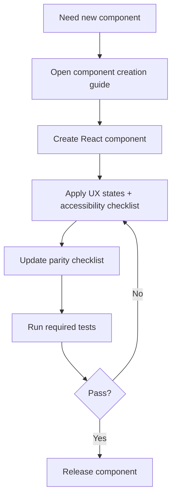
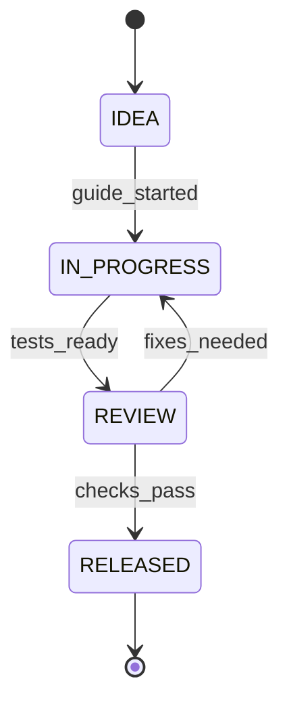

# PRD: aStudio Component Creation & Parity Governance

**Owner:** Jamie Scott Craik (@jscraik)  
**Status:** Draft  
**Last updated:** 2026-01-15  
**Stakeholders:** Jamie (solo dev)  
**Links:** .spec/PROJECT_REVIEW_REPORT.md | docs/architecture/CROSS_PLATFORM.md | docs/architecture/ui-structure-map.md | docs/guides/UI_COMPONENT_TOOLING.md | docs/architecture/cross-platform-design.md

> Rule: If a section is not applicable, write `N/A` and explain why in 1–2 lines.

---

## 0) PRD Summary

- **One-liner:** A single, repeatable component-creation workflow and parity governance process for Jamie to build consistent React + SwiftUI components quickly.
- **Why now:** Current guidance is scattered and parity is partial; the solo workflow needs standardization to cut component delivery time.
- **Desired outcome:** Reduce median time-to-ship for new components from ~48 hours to ≤ 2 hours while improving UI consistency and parity tracking.

---

## 1) Executive Summary

Jamie is building a design-system-first UI workbench across React, ChatGPT widgets, and SwiftUI. Today, component creation is slowed by scattered guidance and partial parity between React and SwiftUI libraries. This PRD defines a unified component creation workflow and parity governance that allows a solo developer to ship components faster without sacrificing consistency or accessibility.

The change introduces a single source of truth for “how to create a component,” explicit parity tracking, and measurable quality gates for UX states, accessibility, and consistency. Success will be measured by reduced time-to-ship, fewer visual regressions, and higher parity coverage. This PRD does not introduce new product features for end users; it focuses on developer productivity and quality.

Out of scope are non-UI backend services, unrelated product features, and any redesign of Apps SDK UI foundations. Technical implementation details are captured in the accompanying Tech Spec.

---

## 2) Problem Statement / Opportunity

### 2.1 Problem

- **Who is affected:** Jamie (solo developer maintaining aStudio’s UI system)
- **Pain today:** Component creation requires hopping across multiple docs; parity decisions are inconsistent and time-consuming.
- **Current workaround:** Manual search across guides and architecture docs; ad-hoc parity decisions.
- **Impact if we do nothing:** Component delivery stays slow (~48 hours), parity lag grows, and UI inconsistencies persist.

### 2.2 Evidence (required)

- Baseline median time-to-ship per component: ~48 hours (solo dev estimate).
- Parity documentation shows React components complete while Swift counterparts remain in progress.
- Guidance is scattered across multiple docs with no single “end-to-end” workflow.

### 2.3 Opportunity

- **What improves if solved:** Faster component delivery, fewer UI regressions, and a clear parity roadmap.
- **Why we’re well-positioned:** Existing architecture, tooling (`pnpm new:component`), and parity docs can be unified into a single workflow.

---

## 3) Target Users / Personas

> Personas must be specific. Each persona should have real context + pain.

| Persona             | Role              | Context                                            | Goals                               | Pain points                               |
| ------------------- | ----------------- | -------------------------------------------------- | ----------------------------------- | ----------------------------------------- |
| Jamie               | Solo UI developer | Builds components across React + SwiftUI + widgets | Ship components quickly with parity | Scattered guidance, slow parity decisions |
| Jamie (Swift focus) | SwiftUI developer | Builds SwiftUI components to match React           | Keep parity without rework          | Unclear parity targets, missing checklist |

**Primary user(s):** Jamie (solo dev)  
**Secondary user(s):** N/A — single-user project.

---

## 4) User Stories

### 4.1 Core user stories (MVP)

1. **Story [STORY-001]:** As Jamie, I want a single component creation guide so that I can build new components consistently without hunting across docs.  
   **Acceptance criteria:**
   - [ ] The guide covers React + Swift parity, tokens, tests, and release steps in one place.
   - [ ] The guide references existing tooling and required docs.
         **Priority:** Must

2. **Story [STORY-002]:** As Jamie, I want a parity checklist so that I can track which Swift components mirror React and what remains.  
   **Acceptance criteria:**
   - [ ] Parity checklist is linked from the component guide.
   - [ ] Parity status is updated for new components.
         **Priority:** Must

3. **Story [STORY-003]:** As Jamie, I want standardized UX state requirements so that every component ships with consistent loading/empty/error states.  
   **Acceptance criteria:**
   - [ ] A required list of UX states is documented for new components.
   - [ ] The guide includes how to validate these states.
         **Priority:** Must

4. **Story [STORY-004]:** As Jamie, I want an accessibility checklist so that every component meets WCAG 2.2 AA expectations.  
   **Acceptance criteria:**
   - [ ] Accessibility checks are documented and required for new components.
   - [ ] The guide defines a manual audit cadence per release.
         **Priority:** Must

5. **Story [STORY-005]:** As Jamie, I want a clear definition of done so that I can ship components quickly without rework.  
   **Acceptance criteria:**
   - [ ] Definition of done includes parity, UX states, and test evidence.
   - [ ] The guide includes release verification steps.
         **Priority:** Should

### 4.2 Use case narratives (recommended)

- **Use case A:** Jamie starts a new component → uses the centralized guide → completes React component + parity checklist → updates Swift parity status → ships with test evidence.
- **Use case B:** Jamie updates a component → uses the checklist to ensure no UX state regression → runs required tests → releases confidently.

---

## 5) Functional Requirements

### Journey: Component creation

- FR-1: Provide a single, end-to-end component creation guide. (Priority: Must)
- FR-2: Include parity checklist and update workflow. (Priority: Must)
- FR-3: Document UX state requirements and validation steps. (Priority: Must)
- FR-4: Define a clear “definition of done” for component releases. (Priority: Should)

### Edge cases & failure UX (required)

- If a component lacks a Swift equivalent, the guide defines how to record the parity gap.
- If a component lacks required UX states, the guide blocks release until states are defined.
- If accessibility checks fail, the guide requires remediation before release.

---

## 6) Non-Functional Requirements

- **Performance:** N/A — documentation-only change; performance budgets are defined in Tech Spec.
- **Reliability:** The guidance must be stable and versioned with the repo.
- **Security & privacy:** No sensitive data; ensure no secrets are embedded in docs.
- **Compliance:** N/A — no regulated data.
- **Accessibility:** WCAG 2.2 AA baseline for component guidance.
- **Observability expectation:** Track component creation time and regressions via repo metrics and CI reports.

---

## 7) Success Metrics / KPIs

| Metric                                |                                   Target | Measurement method  | Source                 |
| ------------------------------------- | ---------------------------------------: | ------------------- | ---------------------- |
| Time to new component (idea → merged) |             Baseline: 48h → Target: ≤ 2h | PR timestamps       | PR history + changelog |
| Component reuse rate                  | ≥ 70% of new UI from existing components | repo stats audit    | manual audit + scripts |
| UI consistency regressions            |             ≤ 2 visual diffs per release | visual test reports | CI visual regression   |
| Accessibility regression rate         |      0 WCAG 2.2 AA violations at release | a11y test + audit   | CI + manual audit      |

**Measurement window:** 30 days post-adoption

### Guardrails (required)

- CI pass rate must not regress below 95%.
- Widget build time P95 must stay ≤ 5 minutes.

---

## 8) Scope

### In scope

- Centralized component creation guide (React + Swift parity + tokens + tests)
- Parity checklist and update workflow
- UX state requirements and definition of done

### Out of scope (required)

- New UI components or features beyond documentation/process updates
- Changes to Apps SDK UI or design tokens

### Non-goals (recommended)

- Full React ↔ Swift parity in this phase
- Redesign of existing components

---

## 9) Dependencies

### Internal

- Existing docs: UI tooling guide, parity docs, UI structure map
- CI test reports and release workflows

### External

- N/A — no external vendors required

### Assumptions about dependencies (required)

- The existing `pnpm new:component` workflow remains available.
- The parity docs remain the canonical source for coverage tracking.

---

## 10) Risks and Mitigations

| Risk                     | Likelihood | Impact | Mitigation                                              |
| ------------------------ | ---------- | ------ | ------------------------------------------------------- |
| Guide becomes stale      | Med        | Med    | Add review cadence and update checklist in release flow |
| Parity checklist ignored | Med        | High   | Make parity update part of definition of done           |
| Metrics not captured     | Med        | Med    | Add simple tracking in CI and changelog review          |

---

## 11) Timeline / Milestones (optional)

| Milestone               | Date       | Notes                       |
| ----------------------- | ---------- | --------------------------- |
| Draft guide + checklist | 2026-01-22 | First version in repo       |
| Review + iterate        | 2026-01-29 | Apply feedback and finalize |

---

## 12) Diagrams & Clarity Checks (recommended)

### 12.1 User journey flow (Mermaid)

### 12.2 State model (Mermaid)

---

## 13) Assumptions & Open Questions (required)

### Assumptions

- A-1: Jamie remains the sole maintainer of the component workflow.
- A-2: Current parity docs remain the authoritative source.

### Open questions

- Q-1: Where will parity status be displayed for fastest access? (Owner: Jamie, Due: 2026-01-22)
- Q-2: What is the preferred location for the consolidated guide? (Owner: Jamie, Due: 2026-01-22)

---

## 14) PRD Integrity Rule (required)

- This PRD defines **WHAT / WHY / WHO**.
- It must **not** prescribe technical implementation details (databases, frameworks, service topology, specific libraries, etc.).
- If any technical detail seems unavoidable, move it to the Tech Spec and reference it from here.

---

## 15) PRD Review Checklist (required)

- [ ] Problem statement is clear and evidence-backed
- [ ] Personas are specific and pains are real
- [ ] Stories follow “As a… I want… so that…”
- [ ] Acceptance criteria are observable/testable
- [ ] Success metrics have numeric targets + measurement method
- [ ] Scope includes explicit OUT
- [ ] Dependencies listed with assumptions
- [ ] Risks are realistic and mitigations exist
- [ ] No technical implementation details
